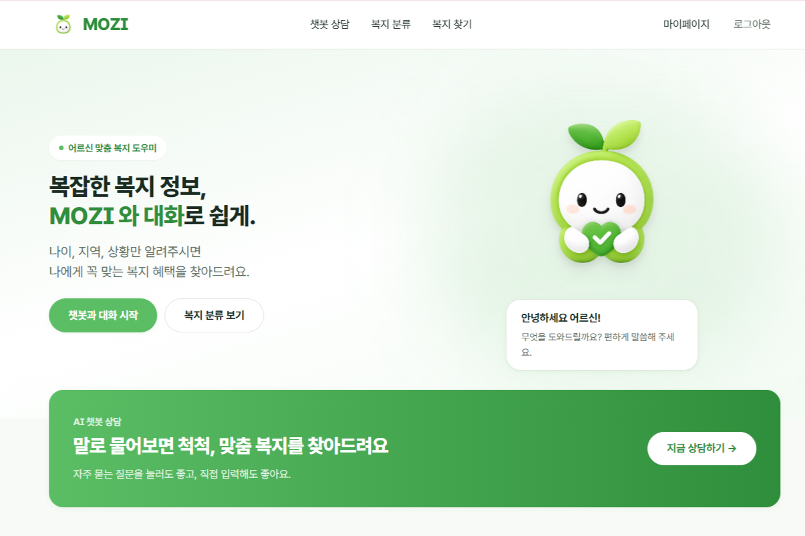
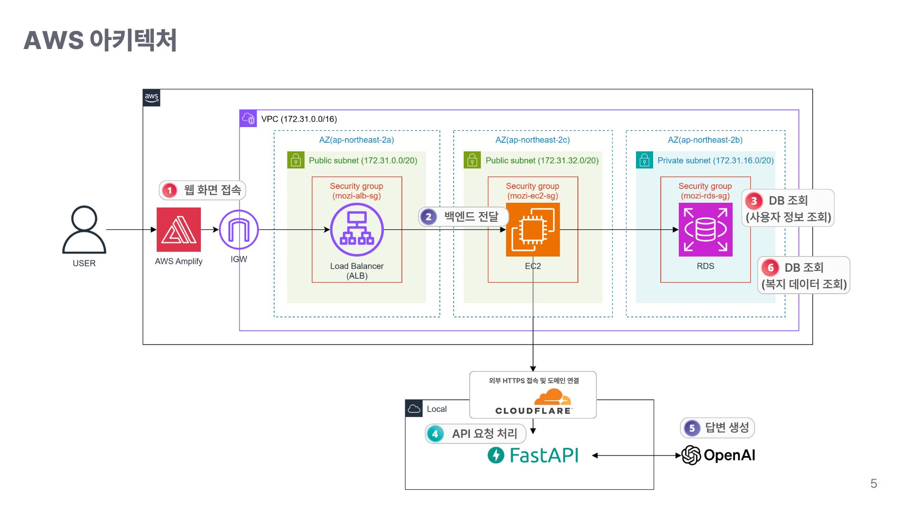
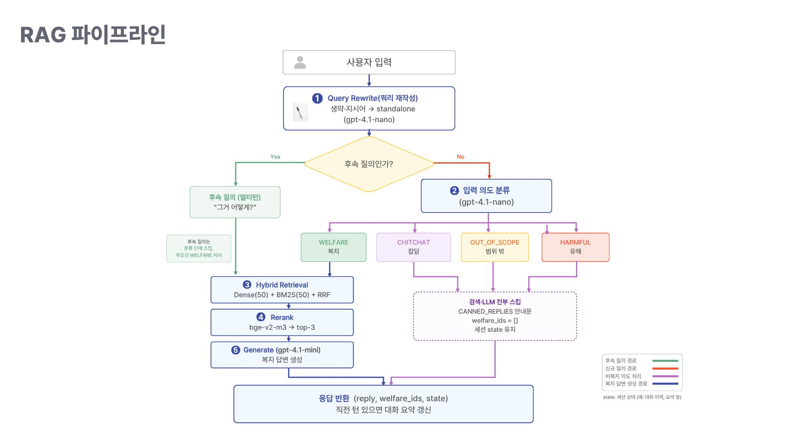

# MOZI (모지) 🌱

> **검색이 아니라 대화로 찾는 복지** — 노년층을 위한 AI 대화형 복지 추천 서비스


<br/>

<!-- 데모 이미지: docs 폴더에 스크린샷/GIF를 넣고 경로를 맞춰주세요 -->
<p align="center">
  
</p>

<br/>

---

## 📌 프로젝트 소개

고령층의 디지털 기기 보유율은 늘고 있지만, 복지 정보를 **탐색하고 활용하는 데는 여전히 어려움**이 존재합니다.

- **정보의 분산** — 복지 정보가 중앙부처·지자체·민간·서울시 등 여러 기관에 흩어져 있어 통합 확인이 어려움
- **검색 중심 구조** — 키워드 입력과 복잡한 필터링에 의존해, 조건을 이해하고 입력해야 하는 부담이 큼
- **사용자 니즈 불일치** — 고령층은 검색보다 *대화 중심*의 정보 탐색을 선호하지만 기존 서비스는 이를 반영하지 못함

**MOZI**는 질문 기반 챗봇과 개인 맞춤 추천을 통해 복지 탐색을 간소화하고, 분산된 정보를 통합하여 누구나 쉽게 이용할 수 있도록 지원합니다.

> 사용자가 자연어로 질문하면 → 개인 조건(연령·지역·상황)에 맞는 복지만 선별해 → 지원 대상·신청 방법까지 한 번에 안내합니다.

**핵심 타깃:** 디지털 기기 사용은 가능하지만 복잡한 서비스 탐색에 어려움을 겪는 **65세 이상 노년층**

<br/>

## 🛠️ 기술 스택

| 구분 | 기술 |
|------|------|
| **Frontend** | AWS Amplify |
| **Backend** | FastAPI, EC2 |
| **Database** | MySQL (RDS) |
| **Vector / Search** | FAISS, BM25 (Hybrid Search) |
| **Embedding** | OpenAI `text-embedding-3-large` (3072-dim) |
| **LLM** | `gpt-4.1-mini` (메인 답변) · `gpt-4.1-nano` (재작성·요약·분류) |
| **Reranker** | `bge-v2-m3` |
| **Data Pipeline** | Python, requests, Pandas |
| **Infra** | AWS (VPC, ALB, EC2, RDS), Cloudflare |
| **Ops** | LangSmith (트레이싱) |

<br/>

## 🏗️ 아키텍처

<p align="center">
  
</p>

- **VPC (172.31.0.0/16)** 내 다중 AZ(ap-northeast-2a/2c/2b) 구성, Public / Private Subnet 분리
- 보안 그룹(`mozi-alb-sg`, `mozi-ec2-sg`, `mozi-rds-sg`)으로 계층별 접근 제어
- Cloudflare를 통한 외부 HTTPS 접속 및 도메인 연결

<br/>

## 🔍 RAG 파이프라인

MOZI의 핵심은 **범용 LLM이 임의로 답하는 것이 아니라, 실제 복지 데이터에 근거해 답변하도록** RAG를 구성하고, 이를 정량 지표로 검증하며 단계적으로 고도화한 과정입니다.

<p align="center">
  
</p>

### 개선 서사 (Baseline → 최종)

| 단계 | 적용 기법 | 성과 |
|------|-----------|------|
| **Baseline** | Semantic 검색만 | Hit@3 `0.4624` / Faithfulness `0.75` |
| **+ Hybrid Search** | BM25 + Semantic (RRF 결합) | Hit@3 `0.6022` |
| **+ Reranker** | `bge-v2-m3`로 후보 문서 재정렬 | Hit@3 `0.7849` |
| **+ Prompt Engineering** | 금지 규칙 + Few-shot 예시 | Faithfulness `0.8741` |
| **+ 예외 처리 / Multi-turn** | Intent 게이트 + Rolling Summary | 불필요한 검색·LLM 호출 및 오응답 감소 |

**최종 성능:** Answer Correctness `0.5335 → 0.5571`, Faithfulness `0.7499 → 0.8741`

<details>
<summary>📖 단계별 상세 보기</summary>

<br/>

**1. Chunking** — 복지 데이터는 레코드(record) 단위 청킹 채택 (512~1024 토큰 구간에서 가장 안정적, nDCG@k 기준 row 단위가 우수)

**2. Embedding** — `text-embedding-3-large` 선정 (MTEB 64.6% / MIRACL 54.9%, 3072-dim)

**3. Vector Store** — 대규모·성능 중심 검색을 위해 **FAISS** 채택 (GPU 가속 지원, HNSW 인덱싱)

**4. Hybrid Search** — 시맨틱 검색(의미 기반)만으로는 "성북구" 같은 지역·대상 조건이 충분히 반영되지 않아 정답 문서가 낮은 순위로 밀리는 문제 발생 → **BM25 키워드 검색을 추가**해 핵심 조건 매칭을 보완하고 RRF로 결합 (최종: DENSE_K=50, BM25_K=50, TOP_N=50)

**5. Reranker** — Hybrid Search로 검색된 후보 문서를 재정렬. Cohere-v3.5가 최고 성능이었으나 응답 시간이 약 3배 길어, 로컬 모델로 비용 부담이 없고 성능 차이도 크지 않은 **`bge-v2-m3`** 최종 선정

**6. 예외 처리 (Intent Gate)** — 검색 전 입력 의도를 분류(`WELFARE` / `CHITCHAT` / `OUT_OF_SCOPE` / `HARMFUL`)하여, 복지 무관 입력은 검색·리랭킹·LLM 생성을 모두 스킵하고 미리 정의한 안내 응답을 반환 → 불필요한 비용·지연 방지

**7. Multi-turn** — "요약 + 직전 1턴 원문" 하이브리드 메모리 구조. Query Rewriting(지시어 해석), Followup 감지, Rolling Summary(핵심 정보 보존)로 대화 맥락을 유지하면서 컨텍스트 무한 증가를 방지

</details>

<br/>

## 🗂️ 데이터

| 항목 | 내용 |
|------|------|
| **수집처** | 복지로, 서울복지포털 |
| **수집 규모** | 총 **1,473건** (중앙부처 87 / 지자체 1,324 / 민간 35 / 서울시 37) |
| **수집 기술** | 웹크롤링 (Python, requests) |
| **정제 구조** | Medallion Architecture (Bronze → Silver → Gold) |
| **최종 산출물** | MySQL 복지 데이터 + FAISS/BM25 검색 인덱스 |

<br/>

## 🚀 시작하기

### 사전 요구사항

- Python 3.x
- MySQL
- OpenAI API Key


<br/>

## 🚀 빠른 시작

각 컴포넌트는 독립적으로 기동합니다. 자세한 안내는 각 폴더의 README를 참고하세요.

### 1) 챗봇 API ([`api/`](api/README.md))

```bash
cd api
python -m venv .venv && source .venv/bin/activate
pip install -r requirements.txt
cp .env.example .env          # OPENAI_API_KEY, CHATBOT_API_KEY 채우기
# 원본 데이터 배치 후 인덱스 빌드 (최초 1회)
cd .. && python -m api.build_indexes
python -m uvicorn api.main:app --port 8000
```

### 2) 백엔드 ([`moji-backend/`](moji-backend/README.md))

```bash
cd moji-backend
cp src/main/resources/application-local.yml.example src/main/resources/application-local.yml
# DB 접속 정보·JWT secret 채우기 (MySQL 8 필요)
./gradlew bootRun            # http://localhost:8080 · Swagger /swagger-ui.html
```

### 3) 프론트엔드 ([`moji-frontend/`](moji-frontend/README.md))

```bash
cd moji-frontend
npm install
cp .env.example .env.local   # VITE_API_BASE_URL=http://localhost:8080
npm run dev                  # http://localhost:5173
```

> 권장 기동 순서: **챗봇 API → 백엔드 → 프론트엔드**.
> 챗봇 서버 없이 백엔드만 시연하려면 `application-local.yml` 에서 `mozi.chatbot.mock-enabled: true`.

---

## 🔐 비밀 정보

비밀 키·DB 비밀번호는 **커밋되지 않습니다**. 각 컴포넌트에 템플릿이 있으니 복사해서 채우세요.

| 컴포넌트 | 템플릿 | 실제 파일 (gitignore) |
|---|---|---|
| api | `api/.env.example` | `api/.env` |
| moji-backend | `moji-backend/src/main/resources/application-local.yml.example` | `application-local.yml` |
| moji-frontend | `moji-frontend/.env.example` | `moji-frontend/.env.local` |

---

## 👥 팀 — 자르바다소코

| 이름 | 역할 | GitHub |
|------|------|--------|
| 박호영 | Back-end & PM | [@handle](https://github.com/) |
| 노유림 | RAG(Generation+Multi-turn) | [@yesurim](https://github.com/yesurim) |
| 신지우 | RAG(Hybrid Search) | [@shinjwcode](https://github.com/shinjwcode) |
| 이소정 | RAG(Hybrid Search) | [@leesojunghub](https://github.com/leesojunghub) |
| 허예진 | RAG(Generation+Multi-turn) | [@yyejinHI](https://github.com/yyejinHI) |


<br/>

## 📚 참고자료

- 국가통계포털(KOSIS), 「장래인구추계: 주요 연령계층별 추계인구 / 전국」
- 송창길, 「2025년 노령 정책 예산 분석」, 보건복지포럼, 한국보건사회연구원, 2025.03
- 황보연, 「키오스크 앞에 선 노년…디지털 조력자 어디 없나요?」, 한겨레, 2025.04.09
