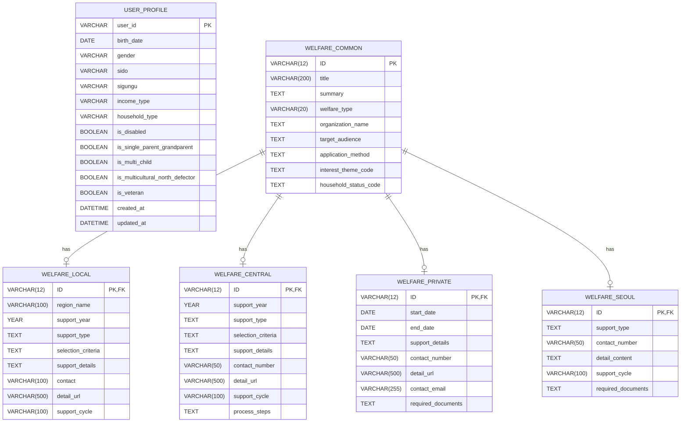

# [MOZI] 데이터베이스(ERD) 설계 요구사항

> 📎 본 문서의 데이터 샘플은 복지로(www.bokjiro.go.kr)와 
> 서울복지포털(wis.seoul.go.kr)의 공개 정보를 시연 목적으로 참고.
> 상업적 활용이나 재배포 X.

## ⚠️ AI(Claude)를 위한 주의사항
아래는 우리가 작성한 **현재의 데이터베이스 초안(As-Is ERD)**과 **실제 크롤링된 데이터 샘플**입니다.
당신은 이 초안과 데이터를 완벽하게 분석하여, 아래 명시된 **'리팩토링 요구사항'**을 반드시 반영해 Spring Data JPA와 RDBMS(MySQL)에 가장 최적화된 테이블 아키텍처(To-Be ERD)로 처음부터 다시 설계해 주어야 합니다.

---

## 📊 1. 현재 데이터베이스 초안 (As-Is ERD)

> ⚠️ **본 As-Is는 역사 기록입니다.** 현재 운영 스키마는 §4 To-Be를 따르며, USER_PROFILE은
> Step 1~10(2026-05-17)에서 재설계되었습니다 (§4-2 (J) 참조). 본 §1은 설계 변천 추적용으로만 유지.



---

## 💾 2. 실제 크롤링 데이터 샘플 (이 데이터를 저장할 수 있어야 함)
※ 주의: 일부 `TEXT` 타입의 데이터는 실제 볼륨이 매우 커서 `... [내용이 길어 중간 생략] ...` 처리하였습니다. 설계 시 해당 컬럼들이 충분히 긴 문자열(LongText 등)을 담을 수 있도록 고려하세요.

### [중앙부처 복지 샘플 - 출처: 복지로]
```json
{
  "ID": "WLF00005442",
  "title": "긴급돌봄 지원사업",
  "summary": "질병, 부상, 주 돌봄자의 갑작스러운 부재(사망, 입원 등), 재난피해 등 돌봄 공백을 신속히 보완해 국민의 돌봄불안을 해소합니다.",
  "welfare_type": "중앙부처복지사업",
  "organization_name": "보건복지부",
  "target_audience": "질병, 부상, 주 돌봄자 부재 등으로 긴급하고 일시적 돌봄지원이 필요하나 기존 서비스로 돌봄을 받기 어려운 국민 (기본 요건) 대상자는 ❶긴급성(한시성), ❷돌봄 필요성, ❸보충성(他 서비스 이용자 제외) 세 가지 요건을 모두 충족하여야 함 ... [내용이 길어 중간 생략] ... ※ 지역별 사업 추진여부가 상이하므로 소재지 관할 읍·면·동 행정복지센터 또는 시·군·구청에 사전 문의 필요",
  "application_method": "본인 신청이 원칙 - (대리 신청) 본인 신청이 어려운 경우 ❶친족*, ❷법정대리인,❸신청자의 이해관계인*신청대리자(‘위임장' 작성) 방문신청 ... [내용이 길어 중간 생략] ... 복지로 온라인신청 경로 : 복지로 로그인 > 서비스 신청 > 복지서비스 신청 > 복지급여 신청 > 긴급돌봄서비스",
  "interest_theme_code": "보호·돌봄,안전·위기",
  "household_status_code": "",
  "support_year": "2026",
  "support_type": "전자바우처(바우처)",
  "selection_criteria": "대상자 선정조사 실시하여 대상자를 선정합니다. (조사방법) 서비스 신청자의 가정에 방문하여 대면으로 요구로 평가표를 통해 조사 ... [내용이 길어 중간 생략] ... 선정된 대상자의 소득에 따라 본인부담금을 차등 부과합니다.",
  "support_details": "대상자로 선정된 자의 긴급한 돌봄 위기를 해소할 수 있도록 ❶신속하고 ❷한시적인 ❸재가방문형 돌봄 서비스를 제공합니다. (지원내용) 일정 자격을 갖춘 제공인력이 대상자의 가정을 방문해 기본돌봄 서비스(재가 돌봄, 가사·이동 지원) 및 방문목욕 서비스 제공 ... [내용이 길어 중간 생략] ... 1,500원을 초과하는 가산 수가는 지방비 또는 본인부담금으로 충당하도록 함",
  "contact_number": "1522-0365",
  "detail_url": "",
  "support_cycle": "1회성",
  "process_steps": "001(읍·면·동 행정복지센터) -> 002(읍·면·동 행정복지센터) -> 003(시·군·구청) -> 004(읍·면·동 행정복지센터) -> 005(긴급돌봄 서비스 제공기관) -> 006(읍·면·동 행정복지센터, 시·도 사회서비스원(광역지원기관))"
}
```

### [지자체 복지 샘플 - 출처: 복지로]
```json
{
  "ID": "WLF00003965",
  "title": "보훈대상자 지원",
  "summary": "의정부시 국가보훈대상자 예우 및 지원 강화 도모",
  "welfare_type": "지자체복지서비스",
  "organization_name": "경기도 의정부시 복지국 복지정책과",
  "target_audience": "1) 지원대상 : 지급기준일 전월 말까지 의정부시 주민등록 완료한 65세 이상의 국가보훈대상자 및 그 유족 및 60~64세까지의 국가보훈대상자 등 그 유족\n2) 선정기준 : 지원대상자 중 지급 신청을 필한 자",
  "application_method": "1) 신청방법 : 동주민센터로 보훈명예수당 및 국가보훈대상자 사망위로금 지급 신청\n2) 지급시기 및 지급방법\n- 보훈명예수당 : 지원대상 요건(해당연령 및 지급신청)을 갖춘 달부터 매월 25일경 입금\n- 사망위로금 : 신청 후 익월 첫째 주에 신청자의 계좌로 입금",
  "interest_theme_code": "서민금융",
  "household_status_code": "보훈대상자",
  "region_name": "경기도 의정부시",
  "support_year": "2022",
  "support_type": "현금지급",
  "selection_criteria": "국가보훈대상자로 만65세이상, 지급기준일 전월 의정부시 주민등록 완료",
  "support_details": "1) 지급내용\n- 보훈명예수당 : 월 13만 원(만65세 이상) 또는 월 8만 원(만60세 이상)\n- 사망위로금 : 15만 원 (국가보훈대상자가 사망할 경우 유족에게 지급_ 사망한 날부터 1년 이내 신청)",
  "contact": "의정부시청 복지정책과 보훈복지팀",
  "detail_url": "[https://www.ui4u.go.kr/main.do](https://www.ui4u.go.kr/main.do)",
  "support_cycle": "월"
}
```

### [민간 복지 샘플 - 출처: 복지로]
```json
{
  "ID": "BOK00000130",
  "title": "사회복지시설 의무보험 (복지시설 손해배상책임공제)",
  "summary": "복지시설(피공제자)이 공제가입증서상의 담보 지역 내에서 공제보험 가입기간 중 발생한, 특약에 기재된 사고로 인하여 타인의 신체에 장해를 입히거나 타인의 재물을 훼손하여 법률상 배상책임을 부담함으로써 입은 손해를 보상하는 공제보험입니다.\n\n※ 본 공제보험은 이하 사회복지사업법 상의 의무보험(화재사고 및 화재 외의 안전사고로 인한 손해배상책임공제(보험))에 해당합니다.",
  "welfare_type": "민간복지서비스",
  "organization_name": "한국사회복지공제회",
  "target_audience": "- 사회복지사업법 제2조에 따른 사회복지법인 및 시설 (노인장기요양기관 등 일부 제외)",
  "application_method": "- 가입문의 : (사)한국사회복지공제회 공제보험사업팀\n(전화)02-3775-8836/8838",
  "interest_theme_code": null,
  "household_status_code": "장애인,한부모·조손,다문화·탈북민",
  "start_date": "2016-01-01",
  "end_date": "2026-12-31",
  "support_details": "- 사회복지관련 기관에서 필수적으로 가입하고 있는 보험\n- 제반경비 최소화로 동일한 보상한도의 경우 시중상품보다 저렴하게 구성하고 관련 법률과 지침의 규정사항을 충족하여 사고 발생 시 적정한 보상이 담보될 수 있도록 함",
  "contact_number": "0237758802",
  "detail_url": "[https://me2.do/G8YKyLYy](https://me2.do/G8YKyLYy)",
  "contact_email": "db_kb210@kwcu.or.kr",
  "required_documents": "1. 사업자등록증 또는 고유번호증\n2. 시설신고필증\n3. 공제청약서"
}
```

### [서울시 복지 샘플 - 출처: 서울복지포털 (복지로와 다른 사이트!)]
```json
{
  "ID": "SEL00000001",
  "title": "고령장애인 활동지원 사업",
  "summary": "활동지원사가 집으로 찾아와 가사활동과 이동·목욕 같은 일상생활을 지원하는 돌봄 서비스",
  "welfare_type": "서울",
  "organization_name": "장애인자립지원과",
  "support_type": "서비스",
  "support_cycle": "상시",
  "detail_content": "만 65세가 도래한 고령 장애인에게 활동지원 서비스 제공",
  "target_audience": "만 65세~73세 기존 활동지원 수급자에서 노인장기요양 전환자 중 월 60시간 이상 감소자",
  "application_method": "지원대상 해당자 자동 신청",
  "required_documents": "없음",
  "contact_number": "02-2133-7475",
  "INTRS_THEMA_CD": "보호·돌봄,생활지원",
  "FMLY_CIRC_CD": "장애인"
}
```

> ⚠️ **주의**: 위 4개 샘플의 **컬럼 구성이 서로 다름**을 반드시 확인할 것.
> - 복지로 데이터 (중앙/지자체/민간): `support_year`, `selection_criteria`, `process_steps` 등 공통 패턴 존재
> - 서울복지포털 데이터: `detail_content`, `INTRS_THEMA_CD`, `FMLY_CIRC_CD` 등 **다른 명명/구조** 사용
> - → 출처 자체가 다른 사이트이므로 **데이터 규격이 근본적으로 상이함**

> 📝 **2026-05-08 업데이트**: MVP 단순화를 위해 서울 데이터의 컬럼명을 시드 단계에서 정규화함.
> - `INTRS_THEMA_CD` → `interest_theme_code`
> - `FMLY_CIRC_CD` → `household_status_code`
> - 원본 보존: `seed-data/welfare-crawled/full/seoul-original.json` (또는 git history)
> - 시드 어댑터에서 출처별 분기 불필요.

---

## 🛠️ 3. 백엔드 리팩토링 요구사항 (To-Be)

당신이 위 초안과 데이터를 바탕으로 새로운 ERD와 엔티티를 설계할 때 **반드시 지켜야 할 규칙**입니다.

### 1. User 도메인 정규화
- 초안의 `USER_PROFILE`은 인증 정보(비밀번호 등)가 빠져 있습니다. 로그인/인증을 담당하는 `USER` 테이블과, 추천을 위한 맞춤 정보를 담는 `USER_PROFILE`을 분리할지 통합할지 논리적으로 설계하세요.

### 2. Welfare 도메인 확장성 확보 및 상속 매핑 (데이터 출처 분리)

#### 2-1. 수정 이전 방식의 문제점 / 수정 이유
- 단순히 지역명(서울)이라고 해서 `WELFARE_LOCAL`에 억지로 병합하면 안 됩니다.
- 서울시 데이터(`WELFARE_SEOUL`)는 **크롤링 출처(서울복지포털) 자체가 다르기 때문에 제공되는 데이터 규격(스키마)이 복지로(중앙/지자체/민간)와 완전히 다릅니다.**
- 이를 하나의 테이블에 병합하면:
  - 빈 컬럼(NULL)이 많아져 정규화 위반
  - 컬럼 의미가 출처마다 달라 유지보수 불가
  - 향후 새로운 출처(부산복지포털 등) 추가 시 또 같은 문제 발생

#### 2-2. 요구사항
- ✅ `WELFARE_SEOUL` 테이블을 `WELFARE_LOCAL`에 **병합하지 말고**, 반드시 **별도의 자식 테이블(엔티티)로 유지**하세요.
- ✅ 데이터 출처(복지로-중앙/지자체/민간 vs 서울복지포털)에 따라 들어오는 JSON 데이터의 구조가 다르므로, `WELFARE_COMMON`을 공통 부모 엔티티로 삼고 각각의 테이블을 자식 엔티티로 두는 **JPA 상속 관계 매핑(Supertype/Subtype)**을 우아하게 적용하세요.
- ✅ 자식 엔티티는 4종 모두 유지: `WelfareCentral`, `WelfareLocal`, `WelfarePrivate`, `WelfareSeoul`
- ✅ 상속 전략 권고: **`JOINED` 전략** (정규화 + 자식별 컬럼 명확)
  - `SINGLE_TABLE`은 NULL 컬럼 폭증 우려로 비추천
  - `TABLE_PER_CLASS`는 부모 단위 조회 비효율로 비추천

#### 2-3. 통합 조회 시 고려사항
- API에서는 4개 자식 테이블을 한 번에 조회/필터링해야 하므로:
  - `WELFARE_COMMON`의 `welfare_type` 컬럼으로 출처 구분
  - 통합 조회 시에는 부모 엔티티(`WelfareCommon`) 기준으로 조회 후, 상세 조회 시 자식 정보 fetch
  - 단, fetch join 또는 `@EntityGraph`로 N+1 방지 필수

### 3. 코드성 데이터 처리
- ~~샘플 데이터의 `interest_theme_code`, `household_status_code`(복지로), `INTRS_THEMA_CD`, `FMLY_CIRC_CD`(서울) 와 같은 콤마(,)로 구분된 텍스트 데이터는 정규화 위반이며 필터링 성능에 악영향을 미칩니다.~~
- ~~출처별로 컬럼명이 다른 점도 주의(`interest_theme_code` vs `INTRS_THEMA_CD`) — **시드 적재 시 통일된 코드 체계로 정규화**하세요.~~
- 이를 Enum 타입이나 별도의 공통 코드 테이블(`Category`, `Tag` 등) 및 매핑 테이블 구조로 분리하여 다대다(N:M) 검색이 가능하도록 설계하세요.
- 출처별 컬럼명은 시드 데이터 정규화 단계에서 이미 통일됨
  (서울 데이터의 `INTRS_THEMA_CD` → `interest_theme_code`로 일괄 변경 완료).
- 시드 적재 시에는 단일 컬럼명으로 처리하면 됨.
- 자세한 카테고리 코드 정의는 `docs/CATEGORY_REFERENCE.md` 참조.

### 4. 신규 연관 관계 추가 (UI/UX 반영)
- 사용자가 특정 복지 정보를 찜할 수 있는 N:M 매핑 해소 테이블(`Bookmark` 등)을 반드시 새롭게 추가하여 설계하세요.
- 북마크는 `User` ↔ `WelfareCommon`(부모) 기준으로 매핑 (자식 어떤 종류든 통일된 방식으로 북마크 가능)

### 5. 인덱스 전략 (성능)
- 자주 검색/필터링되는 컬럼에 인덱스를 명시적으로 설계할 것:
  - `WELFARE_COMMON.welfare_type` (출처별 필터링)
  - `WELFARE_LOCAL.region_name` (지역별 필터링)
  - `BOOKMARK.user_id` (사용자별 북마크 조회)
  - 카테고리/태그 매핑 테이블의 FK들
- 인덱스는 `@Index` 어노테이션 또는 마이그레이션 스크립트로 명시

### 6. 챗봇 대화 이력(ChatLog) 엔티티 — 결정 필요
- USER_FLOW.md에는 챗봇 대화가 핵심 흐름으로 등장
- MVP에서 대화 이력을 DB에 저장할지 여부를 **Phase 0에서 결정**:
  - 옵션 A: 저장 안 함 (단순, MVP 적합) — 챗봇 서버가 자체 보관
  - 옵션 B: 저장 (대화 재개/분석 가능) — `ChatLog`, `ChatMessage` 엔티티 추가
- **권장: 옵션 A (MVP는 단순화, 옵션 B는 v2)**

---

## 📐 4. To-Be ERD 최종안

> Phase 0 종료 시점의 확정안. 본 ERD를 기준으로 Phase 2 엔티티 구현이 진행된다.

### 4-1. 다이어그램 (Mermaid)

```mermaid
erDiagram
    USER ||--|| USER_PROFILE : has
    USER ||--o{ BOOKMARK : owns
    USER ||--o{ REFRESH_TOKEN : issues
    REGION ||..o{ USER_PROFILE : "코드 참조 (FK 없음)"
    WELFARE_COMMON ||--o{ BOOKMARK : "is bookmarked"
    WELFARE_COMMON ||--o| WELFARE_CENTRAL : "extends (JOINED)"
    WELFARE_COMMON ||--o| WELFARE_LOCAL   : "extends (JOINED)"
    WELFARE_COMMON ||--o| WELFARE_PRIVATE : "extends (JOINED)"
    WELFARE_COMMON ||--o| WELFARE_SEOUL   : "extends (JOINED)"
    WELFARE_COMMON ||--o{ WELFARE_CATEGORY : "tagged with"
    CATEGORY       ||--o{ WELFARE_CATEGORY : "applied to"

    USER {
        BIGINT id PK "AUTO_INCREMENT"
        VARCHAR(255) email UK "NOT NULL, unique"
        VARCHAR(100) password "BCrypt hash, NOT NULL"
        VARCHAR(20) role "ENUM(USER, ADMIN), DEFAULT USER"
        DATETIME created_at
        DATETIME updated_at
    }

    REFRESH_TOKEN {
        BIGINT id PK
        BIGINT user_id FK "INDEX"
        VARCHAR(255) token_hash UK "BCrypt or SHA-256"
        DATETIME expires_at
        DATETIME created_at
    }

    USER_PROFILE {
        BIGINT id PK
        BIGINT user_id FK "UK, 1:1 with USER"
        DATE birth_date
        VARCHAR(10) gender "ENUM(M, F, NONE)"
        VARCHAR(2) sido_code "REGION 참조 (FK 없음, 앱 검증)"
        VARCHAR(5) sigungu_code "REGION 참조 (시도만 선택 nullable)"
        VARCHAR(30) income_type "ENUM(IncomeType 5종)"
        VARCHAR(30) household_type "ENUM(HouseholdType 5종)"
        BOOLEAN is_disabled
        BOOLEAN is_multi_child
        BOOLEAN is_multicultural_north_defector
        BOOLEAN is_veteran
        DATETIME created_at
        DATETIME updated_at
    }

    REGION {
        BIGINT id PK "AUTO_INCREMENT"
        VARCHAR(2) sido_code "법정동코드 앞 2자리"
        VARCHAR(20) sido_name "예: 서울특별시, 강원특별자치도"
        VARCHAR(5) sigungu_code "UK, 법정동코드 앞 5자리, 세종은 NULL"
        VARCHAR(40) sigungu_name "예: 강남구, 의정부시. 세종은 NULL"
        DATETIME created_at
        DATETIME updated_at
    }

    WELFARE_COMMON {
        VARCHAR(12) id PK "자연키: WLF / BOK / SEL prefix"
        VARCHAR(200) title
        TEXT summary
        VARCHAR(20) welfare_type "ENUM(CENTRAL,LOCAL,PRIVATE,SEOUL), INDEX"
        TEXT organization_name
        LONGTEXT target_audience
        LONGTEXT application_method
        DATETIME created_at
        DATETIME updated_at
    }

    WELFARE_CENTRAL {
        VARCHAR(12) id PK,FK
        YEAR support_year
        TEXT support_type
        LONGTEXT selection_criteria
        LONGTEXT support_details
        VARCHAR(50) contact_number
        VARCHAR(500) detail_url
        VARCHAR(100) support_cycle
        TEXT process_steps
    }

    WELFARE_LOCAL {
        VARCHAR(12) id PK,FK
        VARCHAR(100) region_name "INDEX"
        YEAR support_year
        TEXT support_type
        LONGTEXT selection_criteria
        LONGTEXT support_details
        VARCHAR(500) contact "다중 부서 연결 케이스 대응 (실측 max 279)"
        VARCHAR(500) detail_url
        VARCHAR(100) support_cycle
    }

    WELFARE_PRIVATE {
        VARCHAR(12) id PK,FK
        DATE start_date
        DATE end_date
        LONGTEXT support_details
        VARCHAR(50) contact_number
        VARCHAR(500) detail_url
        VARCHAR(255) contact_email
        TEXT required_documents
    }

    WELFARE_SEOUL {
        VARCHAR(12) id PK,FK
        TEXT support_type
        VARCHAR(50) contact_number
        LONGTEXT detail_content
        VARCHAR(100) support_cycle
        TEXT required_documents
    }

    CATEGORY {
        BIGINT id PK
        VARCHAR(50) code UK "예: THEME_PROTECT_CARE / STATUS_DISABLED"
        VARCHAR(50) name "보호·돌봄, 장애인 등"
        VARCHAR(20) type "ENUM(THEME, STATUS)"
    }

    WELFARE_CATEGORY {
        BIGINT id PK
        VARCHAR(12) welfare_id FK "INDEX"
        BIGINT category_id FK "INDEX"
    }

    BOOKMARK {
        BIGINT id PK
        BIGINT user_id FK "INDEX"
        VARCHAR(12) welfare_id FK
        DATETIME created_at
    }
```



### 4-2. 핵심 설계 노트

#### (A) ID 정책
- **대리키 (`BIGINT AUTO_INCREMENT`)**: `USER`, `USER_PROFILE`, `CATEGORY`, `WELFARE_CATEGORY`, `BOOKMARK`
- **자연키 (`VARCHAR(12)`)**: `WELFARE_COMMON` 및 4개 자식 — 크롤링 데이터의 원본 ID(`WLF...`, `BOK...`, `SEL...`)를 그대로 사용한다. 출처별 prefix가 있어 추적성도 확보됨.

#### (B) 상속 매핑
- 전략: `@Inheritance(strategy = InheritanceType.JOINED)`
- 구분 컬럼: `welfare_type` (Java enum `WelfareType { CENTRAL, LOCAL, PRIVATE, SEOUL }` → `@Enumerated(EnumType.STRING)`)
- 4개 자식 모두 별도 테이블로 유지 (서울 데이터 통합 금지 — 본 문서 3-2 참고)

#### (C) 카테고리 코드 정규화 정책
- **컬럼명 통일 (시드 데이터 사전 정규화 완료)**: 모든 출처가 `interest_theme_code` / `household_status_code` 사용 (snake_case).
  - 서울 원본은 `INTRS_THEMA_CD` / `FMLY_CIRC_CD`였으나 시드 단계에서 일괄 변경 (2026-05-08, 18건).
  - 원본 보존: `seed-data/welfare-crawled/full/seoul-original.json`
- **Java**: `interestThemeCode` / `householdStatusCode` (camelCase)
- 위 두 컬럼은 **엔티티에 직접 두지 않는다**. 시드 어댑터가 콤마 분리 텍스트를 파싱해 `Category` + `WelfareCategory` N:M 매핑으로 정규화.
- 출처별 분기 없이 **단일 시드 어댑터 로직**으로 처리.
- 자세한 카테고리 코드 정의는 `docs/CATEGORY_REFERENCE.md` 참조.

#### (D) 인덱스 (`@Table(indexes = ...)` 명시)
| 테이블 | 컬럼 | 목적 |
|---|---|---|
| `welfare_common` | `welfare_type` | 출처별 필터링 |
| `welfare_local` | `region_name` | 지역별 필터링 |
| `welfare_category` | `welfare_id` | 카테고리 → 복지 lookup |
| `welfare_category` | `category_id` | 복지 → 카테고리 lookup |
| `bookmark` | `user_id` | 사용자별 북마크 조회 |
| `refresh_token` | `user_id` | 사용자별 토큰 일괄 조회/삭제 |

#### (E) 유니크 제약
- `user.email` UNIQUE
- `user_profile.user_id` UNIQUE (1:1 보장)
- `bookmark(user_id, welfare_id)` 복합 UNIQUE (중복 북마크 방지)
- `category.code` UNIQUE
- `welfare_category(welfare_id, category_id)` 복합 UNIQUE
- `refresh_token.token_hash` UNIQUE (해시 충돌 방지 + lookup)

#### (F) TEXT 길이 정책
크롤링 실데이터 기준 매우 길어 `LONGTEXT` 사용:
- `welfare_common.target_audience`, `welfare_common.application_method`
- `welfare_central.selection_criteria`, `welfare_central.support_details`
- `welfare_local.selection_criteria`, `welfare_local.support_details`
- `welfare_private.support_details`
- `welfare_seoul.detail_content`

상대적으로 짧은 컬럼(`summary`, `support_type`, `process_steps`, `required_documents`)은 `TEXT`.

#### (G) Phase 0 결정 사항 반영 요약
- **Role enum 추가** (`USER`, `ADMIN`) — Spring Security 표준 패턴 대응 (시연 핵심은 USER만 사용).
- **ChatLog 엔티티 없음** — 본 ERD에 미포함. MVP는 챗봇 서버가 대화 이력을 자체 보관하고, MOZI 백엔드는 브릿지 역할만 한다.
- **Category 정규화는 별도 테이블 + N:M 매핑** — Enum 대신 `Category` 엔티티로 두어 향후 카테고리 추가/관리가 쉬움.
- **Bookmark는 `WelfareCommon`(부모) 기준** — 자식 종류와 무관하게 통일된 북마크 가능.
- **RefreshToken 테이블 추가** — Refresh Token Rotation 강제용. 매 갱신 시 이전 row 삭제 + 새 row 발급. 비밀번호 변경/탈퇴/로그아웃 시 일괄 삭제하여 다중 기기 무효화.

#### (H) 회원 탈퇴 / Cascade 정책
- **Hard Delete 적용** (Soft Delete 미사용 — 시연용이라 단순화 + 개인정보 보호 측면에서 명확).
- `User` 삭제 시 cascade 대상:
  - `USER_PROFILE` (1:1)
  - `BOOKMARK` (1:N)
  - `REFRESH_TOKEN` (1:N)
- JPA 매핑: `@OneToMany(cascade = CascadeType.ALL, orphanRemoval = true)`
- DB FK 제약: `ON DELETE CASCADE` 명시 (FK 정의 시).
- **Cascade 대상 아님**: `WELFARE_*` (복지 정보), `WELFARE_CATEGORY`, `CATEGORY`, `REGION` — 사용자와 무관한 공용 데이터.
- 비밀번호 변경 시에도 보안상 해당 user의 `REFRESH_TOKEN` 전체 삭제 → 다중 기기 강제 재로그인.

#### (I) REGION 마스터 (USER_PROFILE_REDESIGN Step 1·8)
- **목적**: USER_PROFILE의 `sido_code`/`sigungu_code` 검증 + 프론트 cascading select(시도→시군구) 응답.
- **데이터 출처**: 행정안전부 법정동코드 (마지막 6자리=0인 시군구 단위만 추출, 약 229행).
- **FK 미설정 정책**:
  - USER_PROFILE은 REGION에 FK를 걸지 않는다 — "시도만 선택" 케이스(sigunguCode=null + sidoCode 존재)를 단일 FK로 표현하기 까다롭기 때문.
  - 대신 `RegionRepository.existsBySidoCode` / `existsBySidoCodeAndSigunguCode`로 **앱 레벨 검증**.
  - 검증 실패 시 `InvalidRegionException` (errorCode `INVALID_REGION_CODE`, HTTP 400).
- **시도 정보 비정규화**: 각 행이 시군구 1개를 표현하되 `sido_code`/`sido_name`을 함께 보관(17개 시도라 중복 부담 무시). 시도 목록은 `SELECT DISTINCT sido_code, sido_name`.
- **엣지 케이스**:
  - 세종특별자치시: 시군구 없음 → 단일 행, `sigungu_code/sigungu_name = NULL`.
  - 제주특별자치도: 제주시/서귀포시 2행.
  - 강원·전북 특별자치도: 2023~2024 행정 변경 반영 (sido_code 51/52).
- **시드**: `seed-data/region/region.json` (행정안전부 표준 + 일반행정구 제외 + 세종 단일 행) → `RegionSeedAdapter` + `RegionSeedLoader`가 부팅 시 자동 적재.
- **명칭 정책**: 풀네임 사용("서울특별시" / "강남구"). `WELFARE_LOCAL.region_name` 크롤링 표기와 정합.

#### (J) USER_PROFILE 재설계 이력 (USER_PROFILE_REDESIGN Step 1~10, 2026-05-17 완료)

As-Is(초기 설계, 본 문서 §1) → To-Be(현재, §4-1) 핵심 변경:

| 항목 | Before (As-Is) | After (To-Be) |
|---|---|---|
| 거주지 | `sido`/`sigungu` VARCHAR 자유 텍스트 | `sido_code`/`sigungu_code` + REGION 마스터 참조 |
| 소득 유형 | `income_type` VARCHAR | `IncomeType` Enum 5종 |
| 가구 형태 | `household_type` VARCHAR | `HouseholdType` Enum 5종 (독거·조손 흡수) |
| boolean | 6종 (독거·장애·조손·다자녀·다문화·보훈) | **4종** (장애·다자녀·다문화·보훈) |
| 검색 활용 | `applyMyProfile`로 boolean 5종 자동 반영 | 미사용 (검색은 명시 query param만) |
| 챗봇 활용 | profile 12 필드 그대로 전송 | **profile 10 필드** + 한글 라벨/만 나이 변환 |
| 행정구역 검증 | 없음 (자유 텍스트) | REGION 코드 존재 + 시도-시군구 일관성 |
| 신규 테이블 | 없음 | `REGION` (229행 마스터) |
| 신규 API | 없음 | `GET /api/regions`, `GET /api/regions?sido={code}` |
| 신규 에러 | 없음 | `INVALID_REGION_CODE` (400) |

근거 문서: `docs/USER_PROFILE_REDESIGN_PLAN.md` (단계별 영향 조사 + 검증 기준).

