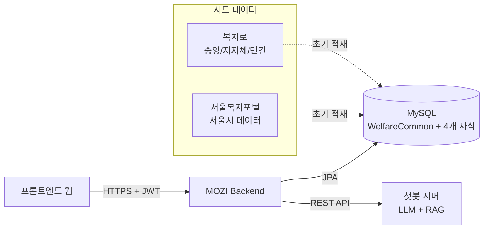
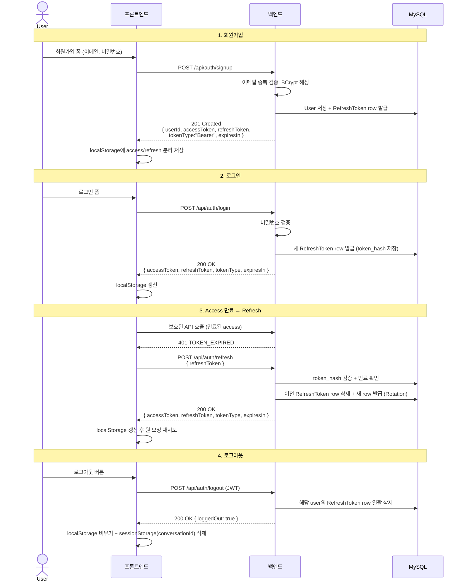
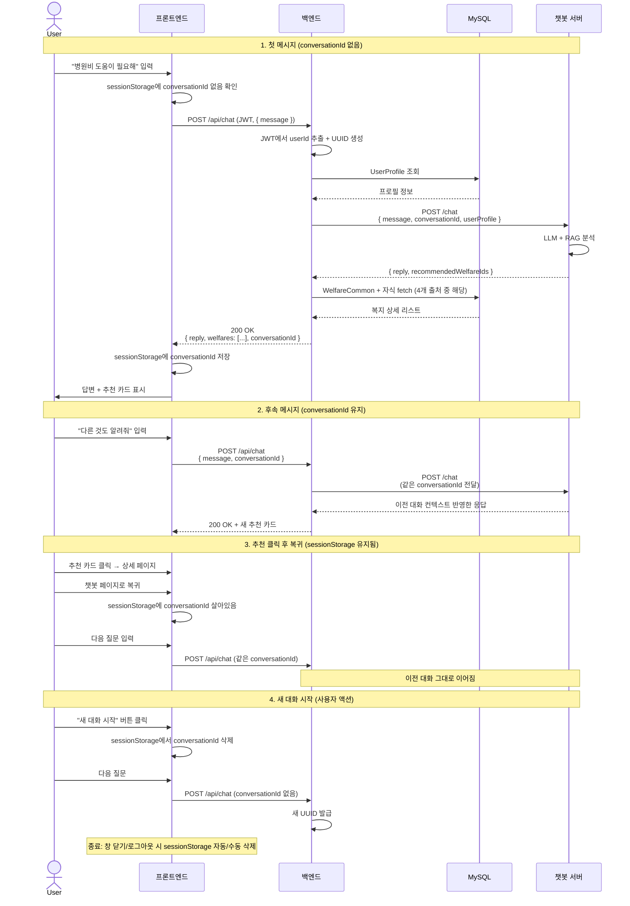
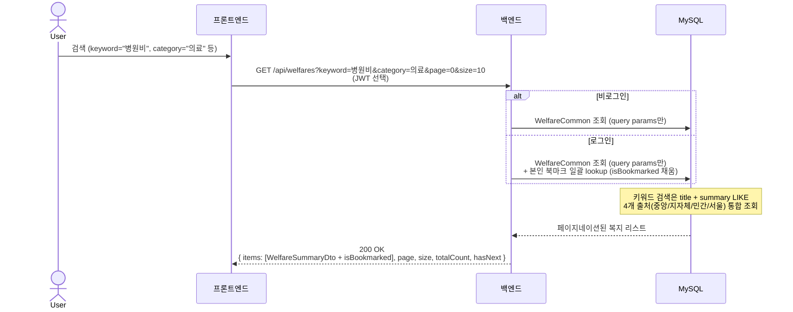
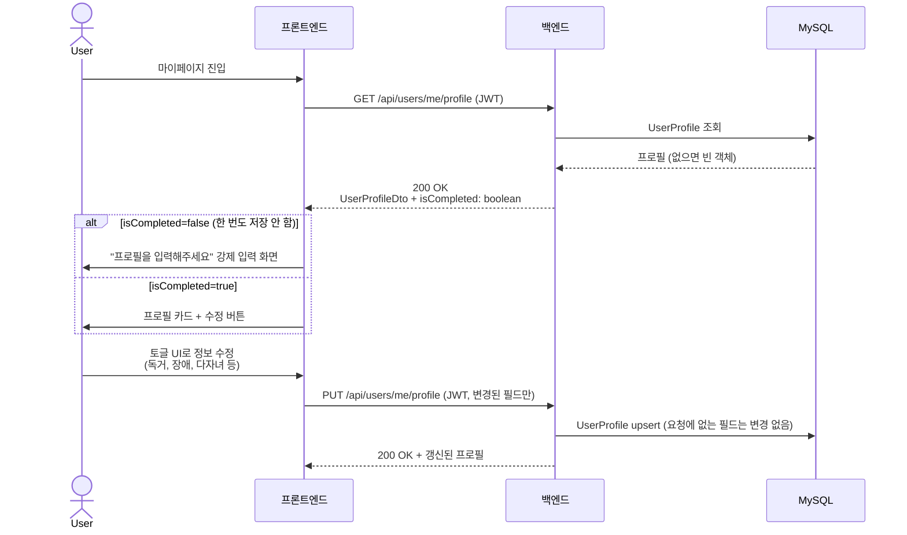
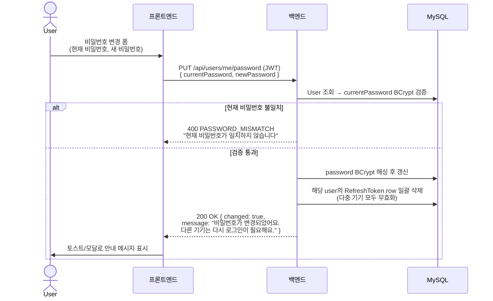
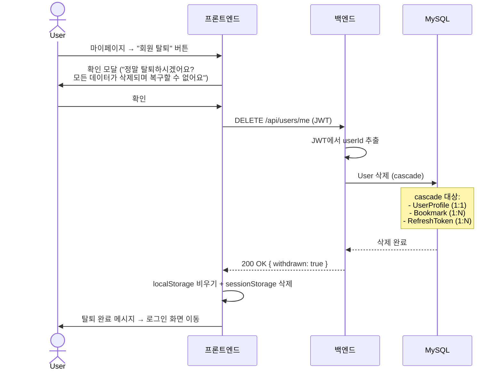

# [MOZI] 노인 통합 복지 사이트 유저 플로우 (Backend)

## ⚠️ AI(Claude)를 위한 주의사항

이 문서는 비즈니스 요구사항(User Journey)을 설명하기 위한 기획 문서입니다.
프론트엔드 화면 UI에 종속되지 말고, 이 흐름을 구현하기 위한 **API-First 방식의 RESTful API 아키텍처**를 설계하세요.

> 본 문서의 시퀀스/응답 형태/파라미터는 `docs/API_SPEC_DRAFT.md`와 일치해야 함. 모순 발생 시 API_SPEC_DRAFT.md가 우선.

---

## 📌 시스템 구성도

- **MOZI Backend**: 본 프로젝트
- **챗봇 서버**: 별도 팀 개발 (외부 시스템)
- **DB**: MySQL
  - `User`, `UserProfile`, `Bookmark`, `RefreshToken`
  - `WelfareCommon`(부모) + 4개 자식 (`WelfareCentral`, `WelfareLocal`, `WelfarePrivate`, `WelfareSeoul`)
  - `Category`, `WelfareCategory` (N:M 매핑)
- **크롤링 데이터**: 시드 스크립트로 DB에 일괄 적재 (실시간 연동 X)
  - 복지로 (3개 출처) + 서울복지포털 (1개 출처) = **4개 출처**
  - 서울 데이터: 컬럼명을 시드 단계에서 정규화 완료 (모든 출처 동일 처리)

---

## 📋 사용자 인증 모델

| 기능 | 비회원 | 회원 |
|---|---|---|
| 회원가입 / 로그인 | ✅ | ✅ |
| 카테고리 / 키워드 / 조건 검색 | ✅ (필터링 X) | ✅ (프로필 자동 필터링, 토글 가능) |
| 복지 상세 조회 | ✅ | ✅ |
| 카테고리 목록 조회 | ✅ | ✅ |
| 챗봇 사용 | ❌ (401) | ✅ |
| 프로필 설정 / 수정 / 탈퇴 | ❌ (401) | ✅ |
| 비밀번호 변경 | ❌ (401) | ✅ |
| 북마크 | ❌ (401) | ✅ |

> 토큰 정책: Access 1h / Refresh 7d. Rotation 적용 (매 갱신 시 새 refreshToken 발급, 이전 token row 삭제).

---

## 🚀 핵심 유저 플로우

### 1️⃣ 회원가입 / 로그인 / 토큰 갱신 / 로그아웃 (Authentication Flow)

**예외 흐름:**
- 이메일 중복 → 409 + `EMAIL_ALREADY_EXISTS` ("이미 가입된 이메일입니다")
- 잘못된 비밀번호 → 401 + `INVALID_CREDENTIALS`
- access 만료 → 401 + `TOKEN_EXPIRED` → 클라이언트가 자동으로 `/api/auth/refresh` 호출
- refresh 만료/위조 → 401 + `INVALID_REFRESH_TOKEN` → 클라이언트가 localStorage 비우고 재로그인 유도
- Validation 실패 (이메일 형식, 비번 길이) → 400 + `VALIDATION_FAILED` + `fields` 객체

---

### 2️⃣ 챗봇 중심 흐름 (Core Flow)

**저장 책임:**
- **MOZI 백엔드**: 대화 이력 저장 X (단순 브릿지)
- **챗봇 서버**: 자체 정책으로 conversationId별 컨텍스트 보관 (LLM 메모리용)

**예외 흐름:**
- 챗봇 서버 timeout (8초 초과) → 504 + `CHATBOT_TIMEOUT` ("지금은 추천이 어려워요. 잠시 후 다시 시도해주세요.")
- 챗봇이 반환한 복지 ID가 DB에 없음 → 해당 ID 누락하고 나머지만 반환 + 서버 로그
- 비로그인 사용자가 챗봇 사용 시도 → 401 + `UNAUTHORIZED`

**프로필 미설정 사용자 처리:** UserProfile이 없는 경우, 빈 프로필을 챗봇에 전달하고 일반적인 추천 받음 (Phase 5 직전 최종 확정).

---

### 3️⃣ 카테고리 / 키워드 / 조건 검색 (Search & Filter Flow)

> ⚠️ **2026-05-17 USER_PROFILE_REDESIGN Step 6 변경**: `applyMyProfile` 토글이 폐기되었다. 검색은 사용자가 명시한 query param만 사용하며, 본인 프로필 기반 추천은 챗봇 흐름(`POST /api/chat`)이 전담한다. 로그인 사용자는 isBookmarked만 자동 반영.

**Query Parameters 의미:**
- `keyword`: title/summary 부분 일치
- `category`: 카테고리 code 단일 값
- `region`: 지역명. CENTRAL/PRIVATE는 region 무관하게 항상 포함, LOCAL은 regionName LIKE 매칭, SEOUL은 region에 "서울" 포함 시에만 통과 (자세한 동작은 API_SPEC_DRAFT §3-3)
- `welfareType`: `CENTRAL` / `LOCAL` / `PRIVATE` / `SEOUL`

**노년층 친화 사용 시나리오:**
- 키워드 + 카테고리 + 지역만으로 단순 검색
- 본인 맞춤 추천은 챗봇 화면(`POST /api/chat`)에서 자연어로 받음

---

### 4️⃣ 마이페이지 / 프로필 설정 (Personalization Flow)

> PUT 동작: 요청에 포함되지 않은 필드는 변경 없음. 명시적 `null`도 변경 없음(MVP 단계 정책).
> Jackson record + nullable 필드 조합에서 absent와 explicit null을 구분할 수 없어 두 케이스를
> 모두 "무변경"으로 통일했다. 필드 클리어가 필요해지면 향후 `JsonNullable` 라이브러리 도입 검토.

---

### 5️⃣ 상세 확인 + 북마크 (Detail & Bookmark Flow)

```mermaid
sequenceDiagram
    actor User
    participant FE as 프론트엔드
    participant BE as 백엔드
    participant DB as MySQL

    User->>FE: 복지 카드 클릭
    FE->>BE: GET /api/welfares/{id} (JWT 선택)
    BE->>DB: WelfareCommon + 해당 자식 fetch join<br/>(welfareType에 따라 Central/Local/Private/Seoul 중 1개)
    alt 로그인
        BE->>DB: 해당 user의 Bookmark 존재 여부 확인
    end
    DB-->>BE: 통합 데이터
    BE-->>FE: 200 OK + WelfareDetailDto<br/>(자식별 필드 + isBookmarked)

    alt isBookmarked=true
        FE->>User: "저장됨" 버튼 표시
    else
        FE->>User: "저장하기" 버튼 표시
    end

    User->>FE: "저장하기" 클릭
    FE->>BE: POST /api/bookmarks/{welfareId} (JWT)
    BE->>DB: Bookmark 저장 (User ↔ WelfareCommon)
    BE-->>FE: 200 OK { bookmarkId } (이미 있으면 idempotent)

    User->>FE: 마이페이지 → "내 북마크"
    FE->>BE: GET /api/bookmarks (JWT, page=0, size=10)
    BE->>DB: Bookmark + WelfareCommon 조인 조회
    BE-->>FE: 200 OK + 북마크 리스트 (페이지네이션)
```

**예외 흐름:**
- 존재하지 않는 welfareId 북마크 시도 → 404 + `WELFARE_NOT_FOUND`
- 이미 북마크한 항목 다시 추가 시 → 200 (idempotent)

---

### 6️⃣ 비밀번호 변경 (Password Change Flow)

**다중 기기 정책:**
- 비밀번호 변경 시 해당 user의 **모든** RefreshToken row 삭제 → 다른 기기에서 다음 access 만료 시 자동으로 `INVALID_REFRESH_TOKEN` 응답 → 재로그인 유도
- 현재 기기의 access도 만료 후 동일 처리되지만, 보안상 권장은 **클라이언트가 즉시 재로그인 화면으로 이동**

---

### 7️⃣ 회원 탈퇴 (Withdrawal Flow — Hard Delete + Cascade)

**정책:**
- **Hard Delete** — Soft Delete 미사용. 시연용이라 단순화.
- 삭제된 사용자는 같은 이메일로 **재가입 가능** (Hard Delete이므로 unique 제약 충돌 없음)
- 카테고리/복지 데이터는 사용자와 무관 — cascade 대상 X

---

## 🎯 시연 시나리오 (졸업 발표용)

발표 시 보여줄 가짜 사용자 시나리오 예시:

### 시나리오 A. "독거노인 김할머니"
- 프로필: 78세, 서울 강남구, 기초연금수급자, 독거, 만성질환
- 챗봇에 "병원비가 부담돼요" 입력
- 기대 추천: 노인 안검진(중앙부처), 의료비 지원(지자체), 긴급돌봄(중앙부처)

### 시나리오 B. "보훈 가족 이할아버지"
- 프로필: 72세, 경기 의정부, 보훈대상자, 부부 가구
- 챗봇에 "보훈 혜택 알려주세요" 입력
- 기대 추천: 보훈명예수당, 사망위로금 등 (지자체 — 의정부시 데이터 활용)

### 시나리오 C. "장애 노인 박할머니"
- 프로필: 67세, 서울 송파구, 장애 보유, 활동지원 필요
- 챗봇에 "활동지원 받을 수 있나요" 입력
- 기대 추천: 고령장애인 활동지원 사업 (서울복지포털 — `WelfareSeoul` 데이터 활용)

> 💡 시나리오 C는 **`WelfareSeoul` 자식 엔티티가 정상 동작함을 시연하는 핵심 시나리오** — 별도 자식으로 분리한 결정의 가치를 보여줌

---

## 📌 백엔드 구현 시 핵심 고려사항

1. **프로필 정보가 챗봇 추천의 핵심** — 프로필 없으면 일반 추천만 가능
2. **챗봇 서버는 외부 시스템** — 인터페이스로 분리, Mock 구현 필수
3. **노년층 친화 에러 메시지** — 5xx 에러도 사용자에게는 친화적 한글로
4. **응답 데이터 페이지네이션** — 한 번에 너무 많은 정보 X (인지 부하 고려)
5. **시연 가짜 사용자가 핵심** — 시드 데이터 다양성 확보 필수
6. **4개 출처 통합 조회** — 사용자에게는 단일 리스트로 보이지만, 내부적으로는 부모/자식 분리 구조
7. ~~**검색 토글(`applyMyProfile`)**~~ — Step 6에서 폐기. 검색은 명시 query param만, 본인 맞춤 추천은 챗봇 흐름이 전담
8. **conversationId는 sessionStorage 기반** — 페이지 이동 OK, 창 닫기/로그아웃 시 자동 종료
