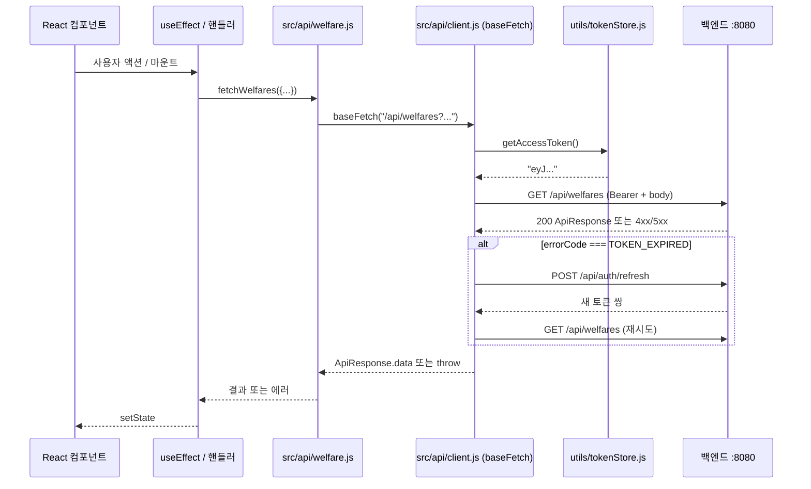

# API CLIENT GUIDE — fetch 기반 백엔드 호출 패턴

> 이 문서는 백엔드 16개 엔드포인트를 호출하기 위한 **클라이언트 코드 표준**을 정의한다.
> 백엔드 응답·에러 코드의 사양은 베끼지 않는다 — `../backend_project/docs/API_SPEC.md`, `ERROR_CODES.md`를 직접 참조한다. 본 문서는 **그것을 어떻게 코드로 호출할지**에만 집중한다.

---

## 1. 전체 그림



핵심 약속:
1. **컴포넌트는 `fetch`를 모른다.** `src/api/*.js`의 함수만 호출
2. `src/api/*.js`는 **`baseFetch`만 호출**, URL/메소드/바디 조합에만 집중
3. `baseFetch`는 토큰 부착·재시도·에러 분기를 책임짐
4. `utils/tokenStore.js`는 토큰 저장(메모리/sessionStorage)을 담당
5. 백엔드 응답 포맷은 `ApiResponse<T>` 래퍼 — `status === "SUCCESS"` 시 `data`만, `"ERROR"` 시 에러 객체 throw

---

## 2. 디렉토리 구조 (`src/api/`)

```
src/api/
├── client.js       # baseFetch + 자동 재시도 + 에러 변환
├── auth.js         # signup, login, refresh, logout
├── user.js         # getMyProfile, updateMyProfile, changePassword, withdraw
├── welfare.js      # fetchWelfares, fetchWelfareDetail
├── bookmark.js     # createBookmark, deleteBookmark, fetchBookmarks
├── category.js     # fetchCategories
└── chat.js         # sendChat
```

옆에 `utils/tokenStore.js`가 자리한다 — `client.js`와 짝이지만 책임이 다르므로 utils에 둠.

---

## 3. `utils/tokenStore.js` — 토큰 저장소

> CLAUDE.md §4-5 토큰 정책의 구체 구현. **accessToken=메모리**, **refreshToken=sessionStorage**.

```javascript
// utils/tokenStore.js

/**
 * 메모리 보관용 accessToken.
 * 모듈 변수로 두면 새로고침 시 사라짐 → 의도된 동작 (refreshToken으로 즉시 복구)
 */
let accessToken = null;

const REFRESH_KEY = "mozi_refresh_token";

/**
 * accessToken 가져오기 (메모리 → null 가능)
 * @returns {string|null}
 */
export function getAccessToken() {
  return accessToken;
}

/**
 * accessToken 메모리에 저장
 * @param {string|null} token
 */
export function setAccessToken(token) {
  accessToken = token;
}

/**
 * refreshToken 가져오기 (sessionStorage)
 * @returns {string|null}
 */
export function getRefreshToken() {
  return sessionStorage.getItem(REFRESH_KEY);
}

/**
 * refreshToken sessionStorage에 저장 (또는 null 시 삭제)
 * @param {string|null} token
 */
export function setRefreshToken(token) {
  if (token) sessionStorage.setItem(REFRESH_KEY, token);
  else sessionStorage.removeItem(REFRESH_KEY);
}

/**
 * 두 토큰 모두 클리어 (로그아웃/탈퇴/refresh 실패 시)
 */
export function clearTokens() {
  setAccessToken(null);
  setRefreshToken(null);
}

// 이 모듈은 토큰 저장소의 단일 출처(single source of truth).
// 메모리 변수를 직접 export하지 않고 getter/setter를 노출하는 이유:
// React 외 코드(api/client.js)에서도 동일하게 접근하기 위함이며, 추후 zustand로 이주해도 인터페이스 유지 가능.
```

> ⚠️ **sessionStorage** 동작 특성: 탭 닫으면 자동 삭제 / 새로고침은 유지 / 같은 origin의 다른 탭과는 공유 X. 본 정책에 정확히 부합.

---

## 4. `api/client.js` — 모든 호출의 진입점

```javascript
// api/client.js
import { getAccessToken, setAccessToken, getRefreshToken, setRefreshToken, clearTokens } from "../utils/tokenStore";

const API_BASE = import.meta.env.VITE_API_BASE_URL; // 예: http://localhost:8080

/**
 * ApiError
 *
 * 백엔드 에러 응답을 자바스크립트 Error로 변환한 클래스.
 * 컴포넌트는 errorCode로 분기한다 (ERROR_CODES.md 참조).
 */
export class ApiError extends Error {
  constructor({ errorCode, message, fields, httpStatus }) {
    super(message || errorCode);
    this.errorCode = errorCode;
    this.fields = fields || null;     // VALIDATION_FAILED일 때만 채워짐
    this.httpStatus = httpStatus;
  }
}

/**
 * baseFetch
 *
 * 모든 API 호출이 거쳐가는 단일 진입점.
 *  - Authorization 헤더 자동 부착
 *  - JSON 직렬화/역직렬화 자동
 *  - ApiResponse<T> 래퍼 해석 → 성공이면 data 반환, 에러면 ApiError throw
 *  - TOKEN_EXPIRED 시 1회만 자동 refresh 후 재시도
 *
 * @param {string} path - "/api/..." 로 시작하는 경로
 * @param {Object} [opts]
 * @param {string} [opts.method="GET"]
 * @param {Object} [opts.body] - JSON으로 직렬화될 객체 (없으면 body 미전송)
 * @param {Object} [opts.query] - URL query string으로 변환할 객체
 * @param {boolean} [opts.skipAuth=false] - true면 Authorization 헤더 안 붙임 (signup/login/refresh)
 * @returns {Promise<any>} ApiResponse.data
 * @throws {ApiError}
 */
export async function baseFetch(path, opts = {}) {
  return doFetch(path, opts, /* retried */ false);
}

async function doFetch(path, opts, retried) {
  const { method = "GET", body, query, skipAuth = false } = opts;

  // 1) 쿼리스트링 구성 (undefined/null 자동 제거)
  const url = buildUrl(path, query);

  // 2) 헤더 구성
  const headers = { "Content-Type": "application/json" };
  if (!skipAuth) {
    const token = getAccessToken();
    if (token) headers["Authorization"] = `Bearer ${token}`;
  }

  // 3) 호출
  let res;
  try {
    res = await fetch(url, {
      method,
      headers,
      body: body !== undefined ? JSON.stringify(body) : undefined,
    });
  } catch (e) {
    // 네트워크 끊김 등
    throw new ApiError({
      errorCode: "NETWORK_ERROR",
      message: "네트워크에 연결할 수 없어요. 잠시 후 다시 시도해주세요.",
      httpStatus: 0,
    });
  }

  // 4) 응답 파싱
  let json;
  try {
    json = await res.json();
  } catch {
    throw new ApiError({
      errorCode: "INVALID_RESPONSE",
      message: "서버 응답에 문제가 있어요. 잠시 후 다시 시도해주세요.",
      httpStatus: res.status,
    });
  }

  // 5) 성공
  if (json.status === "SUCCESS") return json.data;

  // 6) 에러 분기
  if (json.errorCode === "TOKEN_EXPIRED" && !retried && !skipAuth) {
    // 자동 refresh 시도
    const refreshed = await tryRefresh();
    if (refreshed) {
      return doFetch(path, opts, /* retried */ true); // 1회만 재시도
    }
    // refresh 실패 시 토큰 모두 클리어 → 호출자가 라우팅 결정
    clearTokens();
  }

  throw new ApiError({
    errorCode: json.errorCode || "UNKNOWN",
    message: json.message || "알 수 없는 오류가 발생했어요.",
    fields: json.fields,
    httpStatus: res.status,
  });
}

/**
 * tryRefresh
 *
 * sessionStorage의 refreshToken으로 새 토큰 쌍 요청.
 *  - 성공: 새 accessToken/refreshToken 저장 후 true
 *  - 실패: false (refresh 토큰 없음/만료/위조)
 *
 * @returns {Promise<boolean>}
 */
async function tryRefresh() {
  const refreshToken = getRefreshToken();
  if (!refreshToken) return false;

  try {
    const res = await fetch(`${API_BASE}/api/auth/refresh`, {
      method: "POST",
      headers: { "Content-Type": "application/json" },
      body: JSON.stringify({ refreshToken }),
    });
    const json = await res.json();
    if (json.status !== "SUCCESS") return false;
    setAccessToken(json.data.accessToken);
    setRefreshToken(json.data.refreshToken);
    return true;
  } catch {
    return false;
  }
}

/** URL + query string 조립 (undefined/null 자동 제거) */
function buildUrl(path, query) {
  const url = new URL(path, API_BASE);
  if (query) {
    Object.entries(query).forEach(([k, v]) => {
      if (v !== undefined && v !== null && v !== "") {
        url.searchParams.append(k, v);
      }
    });
  }
  return url.toString();
}
```

핵심 설계 결정:
- **`retried` 플래그로 무한 루프 방지** — refresh 후 재호출에서 또 TOKEN_EXPIRED가 와도 다시 refresh 시도 X
- **`skipAuth=true` 옵션** — signup/login/refresh는 토큰 부착 안 함
- **네트워크 에러/JSON 파싱 에러도 ApiError로 통일** — 호출자는 `errorCode`만 분기하면 됨
- **`buildUrl`에서 falsy 값 제거** — boolean `false`는 보존(그대로 `"false"` 문자열로 직렬화), `undefined/null/""`만 제거

> ⚠️ `false`를 쿼리에 보내야 하는 경우(예: 향후 다른 boolean 토글) 위 `buildUrl`은 `false` 그대로 전송한다 (URLSearchParams가 `"false"` 문자열로 직렬화). 백엔드는 이를 boolean으로 파싱 — 문제 없음.

---

## 5. 도메인별 API 함수

### 5-1. `api/auth.js`
```javascript
// api/auth.js
import { baseFetch } from "./client";

export function signup({ email, password }) {
  return baseFetch("/api/auth/signup", {
    method: "POST",
    body: { email, password },
    skipAuth: true,
  });
}

export function login({ email, password }) {
  return baseFetch("/api/auth/login", {
    method: "POST",
    body: { email, password },
    skipAuth: true,
  });
}

export function logout() {
  return baseFetch("/api/auth/logout", { method: "POST" });
}
```

> `refresh`는 `client.js` 내부에서만 호출하므로 별도 export하지 않음.

### 5-2. `api/user.js`
```javascript
// api/user.js
import { baseFetch } from "./client";

/**
 * 응답 (2026-05-17 USER_PROFILE_REDESIGN 이후, FRONTEND_MIGRATION_NOTES.md §2-1):
 *   { isCompleted: false }
 *   또는
 *   {
 *     isCompleted: true,
 *     sidoCode,        // VARCHAR(2) — 라벨은 GET /api/regions로 매핑
 *     sigunguCode,     // VARCHAR(5) | null (세종은 null)
 *     incomeType,      // enum: NATIONAL_BASIC_LIVING | NEAR_POVERTY | BASIC_PENSION | GENERAL | UNKNOWN
 *     householdType,   // enum: LIVING_ALONE | COUPLE | WITH_CHILDREN | GRANDPARENT_GRANDCHILD | OTHER
 *     isDisabled, isMultiChild, isMulticulturalNorthDefector, isVeteran
 *   }
 */
export function getMyProfile() {
  return baseFetch("/api/users/me/profile");
}

/**
 * 프로필 부분 수정 (옵션 C — absent/null 모두 무변경).
 * 호출자가 미리 변경 필드만 추려서 보낸다 — 백엔드는 명시된 필드만 update.
 *
 * 보낼 수 있는 필드:
 *   sidoCode, sigunguCode, incomeType, householdType,
 *   isDisabled, isMultiChild, isMulticulturalNorthDefector, isVeteran
 *
 * 지역 코드가 유효하지 않으면 INVALID_REGION_CODE(400) → §6 에러 분기.
 */
export function updateMyProfile(partial) {
  return baseFetch("/api/users/me/profile", {
    method: "PUT",
    body: partial,
  });
}

export function changePassword({ currentPassword, newPassword }) {
  return baseFetch("/api/users/me/password", {
    method: "PUT",
    body: { currentPassword, newPassword },
  });
}

export function withdraw() {
  return baseFetch("/api/users/me", { method: "DELETE" });
}
```

> Phase 4에서 시도/시군구 옵션을 위해 별도 모듈 `api/region.js` 의 `getRegions(sidoCode?)` 함수를 신설할 예정(기본 호출 = 시도+시군구 트리, sidoCode 지정 시 = 해당 시도의 시군구 평면 목록).

### 5-3. `api/welfare.js`
```javascript
// api/welfare.js
import { baseFetch } from "./client";

/**
 * fetchWelfares
 *
 * 2026-05-17 백엔드 변경으로 `applyMyProfile` 파라미터는 제거됨 (본인 맞춤 추천은 챗봇이 담당).
 *
 * @param {Object} params
 * @param {string} [params.keyword]
 * @param {string} [params.category]      - 단일 카테고리 코드 ("THM003" 등)
 * @param {string} [params.region]
 * @param {"CENTRAL"|"LOCAL"|"PRIVATE"|"SEOUL"} [params.welfareType]
 * @param {number} [params.page=0]
 * @param {number} [params.size=10]
 * @returns {Promise<{items: Array, page: number, size: number, totalCount: number, hasNext: boolean}>}
 */
export function fetchWelfares(params = {}) {
  return baseFetch("/api/welfares", { query: params });
}

export function fetchWelfareDetail(id) {
  return baseFetch(`/api/welfares/${encodeURIComponent(id)}`);
}
```

### 5-4. `api/bookmark.js`
```javascript
// api/bookmark.js
import { baseFetch } from "./client";

export function createBookmark(welfareId) {
  return baseFetch(`/api/bookmarks/${encodeURIComponent(welfareId)}`, { method: "POST" });
}

export function deleteBookmark(welfareId) {
  return baseFetch(`/api/bookmarks/${encodeURIComponent(welfareId)}`, { method: "DELETE" });
}

export function fetchBookmarks({ page = 0, size = 10 } = {}) {
  return baseFetch("/api/bookmarks", { query: { page, size } });
}
```

### 5-5. `api/category.js`
```javascript
// api/category.js
import { baseFetch } from "./client";

/**
 * @param {"THEME"|"STATUS"} type
 * @returns {Promise<Array<{id, code, name, type}>>}
 */
export function fetchCategories(type) {
  return baseFetch("/api/categories", { query: { type } });
}
```

### 5-6. `api/chat.js`
```javascript
// api/chat.js
import { baseFetch } from "./client";

/**
 * @param {Object} args
 * @param {string} args.message
 * @param {string|null} args.conversationId - 첫 호출 시 null
 * @returns {Promise<{reply: string, welfares: Array, conversationId: string}>}
 */
export function sendChat({ message, conversationId }) {
  return baseFetch("/api/chat", {
    method: "POST",
    body: { message, conversationId },
  });
}
```

---

## 6. 에러 분기 — errorCode별 처리 표

> 백엔드 에러 코드 17종의 자세한 의미는 `../backend_project/docs/ERROR_CODES.md` 참조. 본 표는 **프론트에서의 분기 패턴**만.

```javascript
function handleApiError(err, ctx = {}) {
  switch (err.errorCode) {
    // ── 자동 처리되는 케이스 (호출자는 따로 안 해도 됨) ──
    case "TOKEN_EXPIRED":
      // client.js가 자동 refresh → 재시도하므로 호출자가 받을 일은 거의 없음.
      // 받았다면 refresh 자체가 실패 → 로그인 페이지로
      ctx.navigate("/login");
      break;

    case "INVALID_REFRESH_TOKEN":
    case "INVALID_TOKEN":
    case "UNAUTHORIZED":
      // 토큰 무효. 클리어 후 로그인 페이지로
      ctx.clearTokens();
      ctx.navigate("/login");
      break;

    // ── 폼 입력 케이스 ──
    case "VALIDATION_FAILED":
      // fields 객체를 입력란에 매핑
      ctx.setFieldErrors(err.fields || {});
      break;

    case "PASSWORD_MISMATCH":
    case "SAME_PASSWORD":
      // 비밀번호 변경 화면 특화
      ctx.setFieldErrors({ currentPassword: err.message });
      break;

    case "EMAIL_ALREADY_EXISTS":
      ctx.setFieldErrors({ email: err.message });
      break;

    // ── 프로필 수정 (USER_PROFILE_REDESIGN 신규) ──
    case "INVALID_REGION_CODE":
      // 잘못된 sidoCode/sigunguCode 또는 시도-시군구 불일치.
      // 백엔드 message가 케이스별로 다르므로 그대로 토스트 + 시군구 초기화 (FRONTEND_MIGRATION_NOTES.md §3).
      ctx.showToast({ kind: "error", message: err.message });
      ctx.setSelectedSigungu?.("");
      break;

    case "INVALID_CREDENTIALS":
      // 로그인 실패. 어느 필드인지 모르므로 폼 상단에 표시
      ctx.setFormError(err.message);
      break;

    // ── 챗봇 ──
    case "CHATBOT_UNAVAILABLE":
    case "CHATBOT_TIMEOUT":
    case "CHATBOT_INVALID_RESPONSE":
      // 재시도 버튼이 있는 안내 박스
      ctx.showRetry(err.message);
      break;

    // ── 자원 없음 ──
    case "WELFARE_NOT_FOUND":
    case "BOOKMARK_NOT_FOUND":
    case "USER_NOT_FOUND":
      ctx.showToast({ kind: "error", message: err.message });
      break;

    // ── 네트워크/서버 ──
    case "NETWORK_ERROR":
    case "INTERNAL_ERROR":
    case "INVALID_RESPONSE":
    default:
      ctx.showToast({ kind: "error", message: err.message || "잠시 후 다시 시도해주세요." });
      break;
  }
}
```

> 모든 페이지가 이 거대 switch를 직접 쓸 필요는 없다. 페이지 컨텍스트(`ctx`)에 따라 일부만 처리하면 됨. 위는 "어떤 코드가 어디서 발생하는지" 한눈에 보는 참조용.

---

## 7. React 컴포넌트에서 사용하는 패턴

### 7-1. 마운트 시 데이터 페칭
```jsx
import { useEffect, useState } from "react";
import { fetchWelfareDetail } from "../api/welfare";
import { ApiError } from "../api/client";

function WelfareDetailPage({ id }) {
  const [data, setData] = useState(null);
  const [loading, setLoading] = useState(true);
  const [error, setError] = useState(null);

  useEffect(() => {
    let cancelled = false; // 컴포넌트 언마운트 후 setState 방지
    setLoading(true);
    fetchWelfareDetail(id)
      .then((d) => !cancelled && setData(d))
      .catch((e) => !cancelled && setError(e))
      .finally(() => !cancelled && setLoading(false));
    return () => { cancelled = true; };
  }, [id]);

  if (loading) return <Spinner />;
  if (error) return <ErrorView error={error} />;
  return <WelfareDetailBody welfare={data} />;
}
```

### 7-2. 폼 제출 + 검증 에러 매핑
```jsx
import { useState } from "react";
import { login } from "../api/auth";
import { setAccessToken, setRefreshToken } from "../utils/tokenStore";

function LoginPage() {
  const [email, setEmail] = useState("");
  const [password, setPassword] = useState("");
  const [fieldErrors, setFieldErrors] = useState({});
  const [formError, setFormError] = useState("");
  const [submitting, setSubmitting] = useState(false);

  const handleSubmit = async (e) => {
    e.preventDefault();
    setFieldErrors({});
    setFormError("");
    setSubmitting(true);
    try {
      const tokens = await login({ email, password });
      setAccessToken(tokens.accessToken);
      setRefreshToken(tokens.refreshToken);
      // 라우터로 홈 이동
    } catch (err) {
      if (err.errorCode === "VALIDATION_FAILED") setFieldErrors(err.fields || {});
      else setFormError(err.message);
    } finally {
      setSubmitting(false);
    }
  };

  return (
    <form onSubmit={handleSubmit} className="...">
      <Input label="이메일" value={email} onChange={(e) => setEmail(e.target.value)} error={fieldErrors.email} />
      <Input label="비밀번호" type="password" value={password} onChange={(e) => setPassword(e.target.value)} error={fieldErrors.password} />
      {formError && <p className="text-senior-base text-danger">{formError}</p>}
      <Button type="submit" disabled={submitting}>로그인</Button>
    </form>
  );
}
```

### 7-3. (선택) `useApi` 훅으로 보일러플레이트 줄이기
반복되는 loading/error 패턴을 줄이고 싶다면:

```javascript
// hooks/useApi.js
import { useEffect, useState } from "react";

/**
 * useApi
 *
 * fetchFn을 호출해 loading/error/data를 한 번에 관리.
 * 의존성 배열 deps가 바뀌면 재호출.
 */
export function useApi(fetchFn, deps = []) {
  const [data, setData] = useState(null);
  const [error, setError] = useState(null);
  const [loading, setLoading] = useState(true);

  useEffect(() => {
    let cancelled = false;
    setLoading(true);
    setError(null);
    fetchFn()
      .then((d) => !cancelled && setData(d))
      .catch((e) => !cancelled && setError(e))
      .finally(() => !cancelled && setLoading(false));
    return () => { cancelled = true; };
    // eslint-disable-next-line react-hooks/exhaustive-deps
  }, deps);

  return { data, error, loading };
}
```

사용:
```jsx
const { data: welfare, loading, error } = useApi(() => fetchWelfareDetail(id), [id]);
```

---

## 8. `AuthContext` — 토큰·사용자 상태를 트리에 흘리기

> `tokenStore.js`는 모듈 전역 변수라 어디서나 호출 가능하지만, **React 트리가 토큰 변경에 반응하려면 Context가 필요**하다 (예: 로그인 후 헤더가 자동 갱신).

```jsx
// contexts/AuthContext.jsx
import { createContext, useContext, useEffect, useState } from "react";
import { setAccessToken as setTokenInStore, setRefreshToken as setRefreshInStore, getRefreshToken, clearTokens } from "../utils/tokenStore";
import { baseFetch } from "../api/client";

const AuthContext = createContext(null);

/**
 * AuthProvider
 *
 * 앱 최상단에서 한 번 감싼다. 새로고침 직후 sessionStorage에 refreshToken이 있으면
 * 자동으로 토큰 복구를 시도한다.
 */
export function AuthProvider({ children }) {
  const [isAuthenticated, setAuthenticated] = useState(false);
  const [bootstrapping, setBootstrapping] = useState(true);

  // 새로고침 시 토큰 복구 시도 (1회)
  useEffect(() => {
    const refresh = getRefreshToken();
    if (!refresh) { setBootstrapping(false); return; }
    // baseFetch 안의 tryRefresh를 직접 노출하지 않으므로, 가벼운 호출로 토큰 갱신 트리거
    baseFetch("/api/users/me/profile")
      .then(() => setAuthenticated(true))
      .catch(() => clearTokens())
      .finally(() => setBootstrapping(false));
  }, []);

  const login = (accessToken, refreshToken) => {
    setTokenInStore(accessToken);
    setRefreshInStore(refreshToken);
    setAuthenticated(true);
  };

  const logout = () => {
    clearTokens();
    sessionStorage.removeItem("mozi_conversation_id");
    setAuthenticated(false);
  };

  return (
    <AuthContext.Provider value={{ isAuthenticated, bootstrapping, login, logout }}>
      {children}
    </AuthContext.Provider>
  );
}

/** 단축 훅 — 컴포넌트는 Context를 직접 import하지 않는다 */
export function useAuth() {
  const ctx = useContext(AuthContext);
  if (!ctx) throw new Error("useAuth must be used within <AuthProvider>");
  return ctx;
}
```

`main.jsx`:
```jsx
import { AuthProvider } from "./contexts/AuthContext";

createRoot(document.getElementById("root")).render(
  <StrictMode>
    <AuthProvider>
      <App />
    </AuthProvider>
  </StrictMode>,
);
```

보호 라우트:
```jsx
// components/common/ProtectedRoute.jsx
import { Navigate } from "react-router-dom";
import { useAuth } from "../../contexts/AuthContext";

export function ProtectedRoute({ children }) {
  const { isAuthenticated, bootstrapping } = useAuth();
  if (bootstrapping) return <Spinner />;
  if (!isAuthenticated) return <Navigate to="/login" replace />;
  return children;
}
```

---

## 9. conversationId 관리 (챗봇 페이지 전용)

> 챗봇 페이지에서만 쓰이는 값이므로 Context까지 가지 않고 sessionStorage 직접 접근으로 충분.

```javascript
// utils/conversationStore.js
const KEY = "mozi_conversation_id";

export function getConversationId()    { return sessionStorage.getItem(KEY); }
export function setConversationId(id)  { sessionStorage.setItem(KEY, id); }
export function clearConversationId()  { sessionStorage.removeItem(KEY); }
```

ChatPage 사용 예:
```jsx
const handleSend = async (message) => {
  const conversationId = getConversationId(); // 첫 호출 시 null
  const res = await sendChat({ message, conversationId });
  setConversationId(res.conversationId); // 응답값 저장 (첫 호출이면 새로 발급된 ID, 이후엔 동일)
  // res.reply, res.welfares 화면에 추가
};

const handleNewChat = () => {
  clearConversationId();
  // 화면 메시지 리스트도 초기화
};
```

로그아웃 시 `AuthContext.logout`에서 `clearConversationId` 호출 — 위 §8 참조.

---

## 10. 자주 묻는 함정

### 10-1. CORS 에러 (`Access-Control-Allow-Origin`)
- 백엔드 `application.yml`에 `http://localhost:5173`이 허용되어 있음
- 그래도 에러가 뜬다면: 백엔드가 5173이 아닌 다른 포트를 막고 있을 가능성. Vite 출력의 실제 포트 확인 (가끔 5174로 옮겨감)
- 해결: `vite.config.js`에 `server: { port: 5173 }` 명시 강제

### 10-2. `JSON.stringify` 누락 → `[object Object]` 가 전송됨
- 본 가이드의 `baseFetch`는 자동 처리. 절대 컴포넌트에서 직접 `fetch` 하지 말 것

### 10-3. `body: undefined`인 GET 요청에 body가 붙어 에러
- `baseFetch`에서 `body !== undefined`일 때만 직렬화 — 처리됨

### 10-4. refresh 무한 루프
- `retried` 플래그로 1회만 시도. 그래도 발생하면 백엔드의 refresh 응답이 또 TOKEN_EXPIRED를 주는 비정상 상황 → 백엔드 점검 필요

### 10-5. 동시 다발 요청 중 TOKEN_EXPIRED가 동시에 떨어짐
- 본 가이드 구현은 각 요청이 독립적으로 refresh를 시도 → 첫 번째 성공 시 나머지는 INVALID_REFRESH_TOKEN을 받게 됨 (백엔드의 Refresh Token Rotation 정책)
- 완전한 해결은 "refresh 중인 동안 다른 요청을 대기시키는 락" 구현이 필요하지만, **본 MVP는 일단 단순 구현으로 진행**하고 시연 시 문제가 빈번하면 보강
- 보강이 필요해질 신호: 새로고침 직후 동시 발생하는 4~5개 호출에서 INVALID_REFRESH_TOKEN이 자주 보일 때

### 10-6. `import.meta.env.VITE_API_BASE_URL`가 undefined
- 변수명 접두사 `VITE_` 누락 / 개발 서버 재시작 안 함 / `.env.local` 위치 오류 → `PROJECT_SETUP.md` §11-3 참조

### 10-7. `applyMyProfile` 파라미터 — 폐기됨
- 2026-05-17 백엔드 USER_PROFILE_REDESIGN 으로 `GET /api/welfares?applyMyProfile=...` 파라미터는 제거되었다.
- 본인 맞춤 추천은 `POST /api/chat`(챗봇)이 담당한다.
- 검색 URL builder에서 `applyMyProfile` 키가 남아있으면 제거.
- 참고: `buildUrl`은 여전히 falsy 보존 동작을 유지(다른 boolean 쿼리에서 `false`를 그대로 보낼 수 있어야 하므로) — 이 부분 자체는 변경 없음.

### 10-8. `INVALID_REGION_CODE`(400) 처리
- 프로필 저장 시 sigunguCode만 단독 입력 / 존재하지 않는 sidoCode / 시도-시군구 불일치 3종 케이스에서 발생.
- 백엔드 message가 케이스별로 다르므로 그대로 토스트 + 시군구 select 초기화가 기본 처리.
- 시도 코드가 통째로 잘못된 경우(예: 백엔드 REGION 마스터 갱신 후) `GET /api/regions` 재호출로 옵션 캐시를 갱신.

---

## 11. 빠른 참조 — 호출-응답 매트릭스

호출 코드 한 줄 + 기대 반환 타입.

| 호출 | 반환 (성공) |
|---|---|
| `signup({ email, password })` | `{ userId, accessToken, refreshToken, tokenType, expiresIn }` |
| `login({ email, password })` | `{ accessToken, refreshToken, tokenType, expiresIn }` |
| `logout()` | `{ }` |
| `getMyProfile()` | `{ isCompleted, sidoCode, sigunguCode, incomeType, householdType, isDisabled, isMultiChild, isMulticulturalNorthDefector, isVeteran }` (미입력 시 `{ isCompleted: false }`) |
| `updateMyProfile(partial)` | 갱신된 프로필 |
| `changePassword({ currentPassword, newPassword })` | `{ }` |
| `withdraw()` | `{ }` |
| `fetchWelfares({...})` | `{ items, page, size, totalCount, hasNext }` |
| `fetchWelfareDetail(id)` | 상세 DTO (출처별 자식 detail 포함) |
| `fetchCategories("THEME")` | `[{ id, code, name, type }, ...]` |
| `createBookmark(id)` | `{ bookmarkId }` |
| `deleteBookmark(id)` | `{ deleted: true }` |
| `fetchBookmarks({ page, size })` | `{ items, page, size, totalCount, hasNext }` |
| `sendChat({ message, conversationId })` | `{ reply, welfares, conversationId }` |

응답 필드의 정확한 스키마는 `../backend_project/docs/API_SPEC.md` 참조.

---

## 12. 변경 이력

| 날짜 | 변경 내용 |
|---|---|
| 2026-05-15 | 초안 작성 — tokenStore, baseFetch, 도메인 API 모듈, AuthContext, 컴포넌트 사용 패턴, 에러 분기 표 |
| 2026-05-17 | 백엔드 USER_PROFILE_REDESIGN 반영 — user.js JSDoc 새 응답 스키마(sidoCode/sigunguCode/enum/boolean 4종), welfares의 `applyMyProfile` 제거, 에러 분기에 `INVALID_REGION_CODE` 추가, §10-7 정정 + §10-8 신설, §11 매트릭스 갱신. region API는 Phase 4에서 `api/region.js` 신설 예정 |
