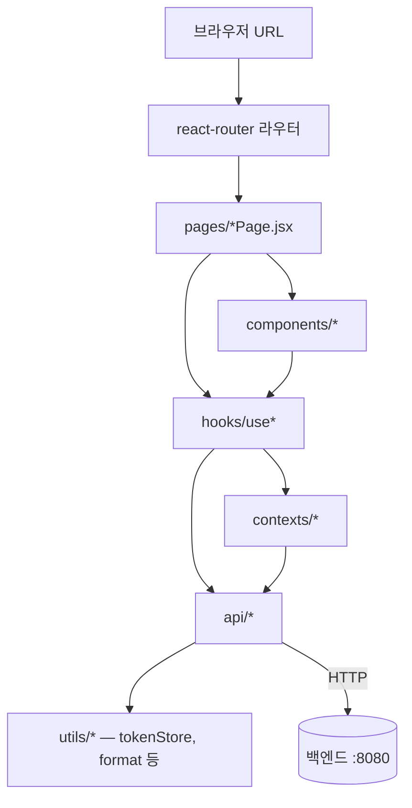

# COMPONENT ARCHITECTURE — 컴포넌트/페이지/훅 분리 원칙

> 이 문서는 "어떤 코드를 어디에 둘 것인가"를 결정한다.
> 프론트 처음이라면 이 부분에서 시간을 가장 많이 잃는다 — 본 문서의 휴리스틱을 따라가면 갈팡질팡 없이 진행 가능.

---

## 1. 큰 그림 — 계층 구조



핵심 원칙:
- **위에서 아래로만 의존** — 페이지가 컴포넌트를 부르고, 컴포넌트가 훅을 부른다. **역방향 금지** (컴포넌트가 페이지를 import하지 않는다)
- **fetch는 항상 `api/`를 통해서만** — 컴포넌트가 직접 `fetch()`를 호출하지 않는다
- **상태는 가장 가까운 곳에서 시작** — 한 페이지 안에서만 쓰는 상태는 그 페이지 안의 `useState`. 여러 페이지가 공유해야 할 때만 위로 올린다

---

## 2. 폴더 구조 상세

```
src/
├── main.jsx                  # 진입점. ReactDOM.createRoot + StrictMode + AuthProvider 래핑
├── App.jsx                   # 라우터 정의. BrowserRouter + Routes
├── index.css                 # Tailwind + 글로벌 base
│
├── pages/                    # URL과 1:1 매핑되는 페이지
│   ├── LoginPage.jsx
│   ├── SignupPage.jsx
│   ├── ChatPage.jsx          # /
│   ├── WelfareSearchPage.jsx # /welfares
│   ├── WelfareDetailPage.jsx # /welfares/:id
│   ├── BookmarksPage.jsx     # /bookmarks
│   └── MyPage.jsx            # /me 외 마이페이지 묶음
│
├── components/               # 재사용 컴포넌트
│   ├── common/               # 도메인 무관 (Button, Input, Card, Modal, Toast, Spinner, AppHeader, ProtectedRoute)
│   ├── welfare/              # 복지 도메인 (WelfareCard, WelfareFilterBar, WelfareDetailBody)
│   └── chat/                 # 챗봇 도메인 (ChatBubble, ChatInput, RecommendedWelfares)
│
├── hooks/                    # 커스텀 훅 (use*)
│   ├── useAuth.js            # 인증 Context 접근 단축
│   ├── useApi.js             # 로딩/에러 상태 보일러플레이트 줄임
│   └── useToast.js           # Toast 큐 접근
│
├── contexts/                 # React Context Provider
│   ├── AuthContext.jsx       # accessToken (메모리) + user 정보
│   └── ToastContext.jsx      # 토스트 큐 관리
│
├── api/                      # 백엔드 호출 함수 (도메인별)
│   ├── client.js             # baseFetch + 토큰 자동 첨부 + 자동 재시도
│   ├── auth.js
│   ├── user.js
│   ├── welfare.js
│   ├── bookmark.js
│   ├── category.js
│   └── chat.js
│
├── utils/                    # 순수 함수 유틸 (입출력만, 사이드이펙트 X)
│   ├── tokenStore.js         # refreshToken sessionStorage 접근 + accessToken 메모리 보관
│   ├── format.js             # 날짜·금액 포맷
│   └── errorMessages.js      # errorCode → 친화적 한글 메시지 매핑 (백엔드 message 보완용)
│
└── styles/                   # 글로벌 CSS (대부분 비어있음, Tailwind 우선)
```

> 자세한 API 호출 코드는 `API_CLIENT_GUIDE.md` 참조. 본 문서는 폴더 의도와 분리 원칙에만 집중.

---

## 3. 페이지(Page) vs 일반 컴포넌트(Component)

| 구분 | 페이지 | 일반 컴포넌트 |
|---|---|---|
| 위치 | `src/pages/` | `src/components/` |
| 명명 | `~Page.jsx` 접미 | 의미 단어 (`WelfareCard.jsx`) |
| 라우팅 | URL과 직접 매핑 | URL 모름 |
| 데이터 페칭 | 페이지가 시작점 (useEffect로 fetch) | props로 받기만 함 |
| 재사용 | 라우팅 단위 (재사용 X) | 여러 페이지에서 import |
| 예시 | `LoginPage` | `Button`, `WelfareCard`, `ChatBubble` |

### 휴리스틱
- **URL을 가진다 → 페이지**
- **여러 곳에서 쓰일 가능성 → 컴포넌트**
- 헷갈리면 우선 컴포넌트로 만들고, 페이지가 그 컴포넌트만 호출하는 얇은 래퍼가 되어도 OK

---

## 4. 컴포넌트 분리 기준 (휴리스틱)

> 모든 코드를 작게 쪼개라는 말이 아니다. 다음 신호 중 **2개 이상** 만족하면 분리 검토.

| 신호 | 설명 |
|---|---|
| 반복 | 같은 마크업이 3번 이상 나타남 |
| 책임 다름 | 한 컴포넌트가 두 가지 일을 함 (예: 검색 입력 + 결과 카드 둘 다 직접) |
| 길이 | JSX 본문이 100줄을 넘음 |
| 상태 많음 | `useState`가 4개 이상 |
| 테스트 어려움 | 한 부분만 테스트하고 싶은데 다른 게 얽혀 안 됨 |

### 분리 예시 — Before
```jsx
// 200줄짜리 WelfareSearchPage.jsx
function WelfareSearchPage() {
  // 검색 input 상태 5개
  // 필터 토글 상태 3개
  // 결과 리스트 fetch 로직
  // 빈 상태 처리
  // 카드 렌더링 100줄
  // 페이지네이션
  return ( /* 200줄 JSX */ );
}
```

### After
```jsx
// 30줄짜리 WelfareSearchPage.jsx
function WelfareSearchPage() {
  const { filters, setFilters, results, page, totalPages, goToPage } = useWelfareSearch();
  return (
    <main className="...">
      <WelfareFilterBar value={filters} onChange={setFilters} />
      <WelfareCardList items={results} />
      <Pagination page={page} totalPages={totalPages} onChange={goToPage} />
    </main>
  );
}
```

3가지가 동시에 일어남:
- 검색 로직 → `useWelfareSearch` 훅으로
- 필터 UI → `WelfareFilterBar` 컴포넌트로
- 카드 리스트 → `WelfareCardList` 컴포넌트로

---

## 5. 컴포넌트 작성 템플릿

> CLAUDE.md §4-7의 주석 정책을 그대로 코드 템플릿으로.

```jsx
import { useState } from "react";

/**
 * WelfareCard
 *
 * 복지 정보 한 건을 카드 형태로 표시한다.
 * 카드 전체가 클릭 가능하며, 우상단의 북마크 버튼은 별도 클릭 이벤트를 가진다(stopPropagation).
 *
 * @param {Object} props
 * @param {Object} props.welfare - 복지 요약 데이터 (백엔드 WelfareSummaryDto)
 * @param {string} props.welfare.id
 * @param {string} props.welfare.title
 * @param {string} props.welfare.summary
 * @param {"CENTRAL"|"LOCAL"|"PRIVATE"|"SEOUL"} props.welfare.welfareType
 * @param {boolean} props.welfare.isBookmarked
 * @param {(id: string, next: boolean) => void} props.onBookmarkToggle - 북마크 토글 핸들러
 * @param {() => void} props.onClick - 카드 클릭 (상세 페이지 이동)
 * @returns {JSX.Element}
 */
function WelfareCard({ welfare, onBookmarkToggle, onClick }) {
  // 낙관적 업데이트: 백엔드 응답 기다리지 않고 즉시 UI 반영
  const [pending, setPending] = useState(false);

  const handleBookmark = (e) => {
    e.stopPropagation(); // 카드 클릭 이벤트로 전파 막기
    setPending(true);
    onBookmarkToggle(welfare.id, !welfare.isBookmarked);
    setPending(false);
  };

  return (
    <article
      className="p-5 rounded-card bg-surface border border-surface-border shadow-card cursor-pointer hover:shadow-modal"
      onClick={onClick}
    >
      {/* 출처 뱃지 */}
      <span className="inline-block px-3 h-8 leading-8 rounded-pill bg-brand-subtle text-brand text-senior-sm">
        {labelOfType(welfare.welfareType)}
      </span>
      <h3 className="mt-3 text-senior-lg text-ink-strong">{welfare.title}</h3>
      <p className="mt-2 text-senior-base text-ink">{welfare.summary}</p>

      <button
        type="button"
        className="mt-4 h-12 px-4 rounded-soft border border-surface-border text-senior-base"
        onClick={handleBookmark}
        disabled={pending}
      >
        {welfare.isBookmarked ? "저장됨" : "저장하기"}
      </button>
    </article>
  );
}

/** 출처 enum을 사용자 친화 한글로 변환 */
function labelOfType(t) {
  return { CENTRAL: "중앙부처", LOCAL: "지자체", PRIVATE: "민간", SEOUL: "서울복지" }[t] ?? t;
}

export default WelfareCard;

// 이 컴포넌트는 카드 + 북마크 버튼이 한 단위로 묶여 있으며, 북마크 클릭이 카드 클릭으로 전파되지 않도록 stopPropagation을 사용한다.
```

핵심 포인트:
- 컴포넌트 위 JSDoc (한 줄 요약 + props 명시)
- 비즈니스적으로 의도 있는 부분에만 한 줄 주석
- 보조 함수(`labelOfType`)는 같은 파일 하단에
- 파일 말미 1~2문장 요약 주석

---

## 6. 커스텀 훅(Custom Hook) — 언제 만드나

> **커스텀 훅**: `useXxx`로 시작하는 함수. 상태·effect를 묶어 컴포넌트 간 재사용하기 위한 React의 표준 패턴.

### 작성 시점
- `useState`가 3개 이상 묶여 한 의미를 이룰 때
- 같은 데이터 페칭 로직이 2개 이상 컴포넌트에 반복될 때
- 사이드이펙트(`useEffect`)가 복잡해서 컴포넌트 본문이 더러워질 때

### 예시 — `useWelfareSearch.js`
```javascript
import { useState, useEffect, useCallback } from "react";
import { fetchWelfares } from "../api/welfare";

/**
 * useWelfareSearch
 *
 * 복지 검색 페이지의 검색 조건/결과/페이지네이션 상태를 한 곳에서 관리한다.
 * 페이지 컴포넌트는 이 훅이 반환하는 값만 가져다 쓰면 된다.
 *
 * @returns {{
 *   filters: Object,
 *   setFilters: (next: Object) => void,
 *   results: Array,
 *   loading: boolean,
 *   hasNext: boolean,
 *   loadMore: () => void
 * }}
 */
export function useWelfareSearch() {
  const [filters, setFilters] = useState({ keyword: "", category: null, region: "", welfareType: null });
  const [page, setPage] = useState(0);
  const [results, setResults] = useState([]);
  const [hasNext, setHasNext] = useState(false);
  const [loading, setLoading] = useState(false);

  useEffect(() => {
    // 필터가 바뀌면 결과 초기화 후 첫 페이지 재조회
    setResults([]);
    setPage(0);
  }, [filters]);

  useEffect(() => {
    setLoading(true);
    fetchWelfares({ ...filters, page })
      .then((res) => {
        setResults((prev) => (page === 0 ? res.items : [...prev, ...res.items]));
        setHasNext(res.hasNext);
      })
      .finally(() => setLoading(false));
  }, [filters, page]);

  const loadMore = useCallback(() => setPage((p) => p + 1), []);

  return { filters, setFilters, results, loading, hasNext, loadMore };
}
```

> 훅 작성 시 주의:
> - 훅은 다른 훅 안에서만 호출 가능 (조건문/반복문 안 X)
> - return은 객체로 명명 반환 권장 (위치 기반 배열 반환은 React 내장 훅처럼 짧을 때만)

---

## 7. Context — 언제 만드나

> **Context API**: React 내장의 전역 상태 메커니즘. Provider로 감싼 트리 어디서나 값에 접근 가능.

### 도입 신호
- 트리 깊은 곳에서 동일 값을 props로 계속 전달해야 할 때 (prop drilling)
- 로그인 사용자, 토큰, 토스트 큐, 테마 등 **앱 전체에서 자주 쓰이는 값**

### 본 프로젝트의 Context (3개로 한정)
| Context | 보관 값 | 사용처 |
|---|---|---|
| `AuthContext` | `{ accessToken, user, login, logout }` | 보호된 페이지 라우팅, API 호출 시 토큰 부착 |
| `ToastContext` | `{ toasts, showToast }` | 어떤 컴포넌트든 토스트를 띄울 수 있게 |
| (필요 시) `ChatSessionContext` | `{ conversationId, resetConversation }` | 챗봇 페이지 + 헤더 "새 대화" 버튼 |

> 모든 페이지/컴포넌트가 Context를 직접 import하는 대신, 단축 훅(`useAuth`, `useToast`)을 거치게 한다 (§9 명명 규칙).

### 예시 — `contexts/AuthContext.jsx`
구체 구현은 `API_CLIENT_GUIDE.md` §토큰 저장소에서 상세히.

---

## 8. zustand 도입 신호 — 아직 도입하지 않음

> **zustand**: 작은 전역 상태 관리 라이브러리. Redux보다 가볍고, Context보다 성능 좋음.

본 프로젝트는 **우선 도입하지 않는다**. 다음 신호가 나타나면 사용자에게 도입을 제안:

- Context Provider가 **5개 이상 중첩**됨 (main.jsx에서 `<A><B><C><D><E>App</E></D></C></B></A>` 형태)
- prop drilling이 **3단계 이상 깊어짐** (페이지 → 자식 → 손자에게 prop 넘김)
- 같은 데이터를 **여러 페이지에서 동시 갱신**해야 함 (예: 검색 결과를 헤더와 본문이 동시에 보여줘야 함)
- Context 값이 자주 바뀌어 **불필요한 리렌더가 눈에 띄게 발생** (DevTools Profiler로 확인)

도입 결정 시 절차:
1. 어떤 상태를 zustand로 옮길지 명확히
2. `package.json`에 추가하기 전 사용자에게 의도 보고 + 승인 (CLAUDE.md §5-3)
3. 한 도메인부터 점진 도입 (한꺼번에 전부 X)

---

## 9. 명명 규칙 (Naming)

### 9-1. 파일/폴더
| 종류 | 규칙 | 예시 |
|---|---|---|
| 컴포넌트 파일 | PascalCase + `.jsx` | `WelfareCard.jsx` |
| 페이지 파일 | PascalCase + `Page.jsx` | `LoginPage.jsx` |
| 훅 파일 | camelCase + `.js` | `useAuth.js` |
| Context 파일 | PascalCase + `Context.jsx` | `AuthContext.jsx` |
| API 모듈 | 도메인 단수형 + `.js` | `welfare.js`, `bookmark.js` |
| 유틸 파일 | camelCase + `.js` | `tokenStore.js` |
| 폴더 | camelCase 소문자 | `components`, `hooks` |

### 9-2. 식별자
| 종류 | 규칙 | 예시 |
|---|---|---|
| 컴포넌트 | PascalCase | `function WelfareCard()` |
| 훅 | `use` + PascalCase | `useAuth`, `useWelfareSearch` |
| 일반 함수 | camelCase | `formatDate()` |
| API 함수 | 동사 + 명사 (camelCase) | `fetchWelfares()`, `createBookmark()`, `deleteBookmark()` |
| 상수 | SCREAMING_SNAKE | `API_BASE`, `TOKEN_KEY` |
| Context | PascalCase + `Context` | `const AuthContext = createContext()` |
| boolean 변수 | `is*` / `has*` / `should*` | `isLoading`, `hasNext`, `shouldRetry` |
| 이벤트 핸들러 prop | `on*` | `onClick`, `onBookmarkToggle` |
| 이벤트 핸들러 내부 함수 | `handle*` | `handleSubmit`, `handleBookmark` |

### 9-3. CSS 클래스 (Tailwind)
- 직접 정의하지 않는다 (Tailwind 토큰만 사용)
- 토큰 이름 규칙은 `STYLING_GUIDE.md` §2 참조

---

## 10. 자주 묻는 함정

### 10-1. 페이지에서 fetch를 직접 하려고 했다
- 금지. `src/api/*` 함수만 사용 (CLAUDE.md §4-3, `API_CLIENT_GUIDE.md` 참조)

### 10-2. 페이지 컴포넌트에서 다른 페이지를 import하려고 했다
- 잘못. 페이지 간 이동은 react-router의 `useNavigate()` 또는 `<Link>`로

### 10-3. Context를 너무 일찍 도입했다
- 단일 페이지에서만 쓰는 상태는 `useState`로 충분. Context는 "트리 깊은 곳에서 prop drilling이 실제로 발생할 때" 도입

### 10-4. props가 10개를 넘는다
- 분리 신호. 자식 컴포넌트로 책임을 나누거나, props를 객체로 묶어 전달

### 10-5. 같은 컴포넌트를 components/common과 components/welfare에 둘 다 두었다
- 한 곳에 둔다. 도메인 무관이면 common, 특정 도메인 의존이면 도메인 폴더

---

## 11. 변경 이력

| 날짜 | 변경 내용 |
|---|---|
| 2026-05-15 | 초안 작성 — 계층 다이어그램, 폴더 구조, 페이지/컴포넌트/훅/Context 분리 기준, 명명 규칙 |
| 2026-05-17 | §4 After 예시를 페이지 번호 페이지네이션 패턴(Pagination 컴포넌트 + goToPage)으로 갱신 |
