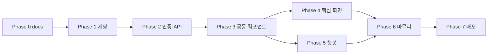

# EXECUTION PLAN — 프론트엔드 단계별 실행 계획

> 본 문서는 프론트엔드를 어떤 순서로 만들지 정의한다. 백엔드 `EXECUTION_PLAN.md`와 동일한 원칙으로 작성됨.
> **각 Phase는 끝나면 동작하는 상태**를 만들고 다음으로 넘어간다. 검증 기준을 통과하지 못한 Phase는 미완으로 본다.

---

## 진행 원칙

1. Phase 단위로 작업 → 검증 → 커밋 → 다음 Phase
2. 한 Phase가 끝나면 사용자가 직접 `npm run dev`로 띄워 **수동 검증**
3. UI 변경은 반드시 브라우저로 골든 패스 + 에러 케이스 확인 (CLAUDE.md §4-6)
4. Phase별로 별도 feature 브랜치 (예: `feature/phase-1-setup`) 사용 권장
5. 코드 작성 전 화면 구조·호출 흐름을 사용자에게 제안하고 승인 받기 (CLAUDE.md §4-6)

---

## Phase 진행 상황 (한눈에)

| Phase | 상태 | 핵심 산출물 |
|---|---|---|
| 0. 사전 설계 (이 docs 작성) | ✅ | CLAUDE.md, PRD.md, PROJECT_SETUP.md, STYLING_GUIDE.md, COMPONENT_ARCHITECTURE.md, API_CLIENT_GUIDE.md, USER_FLOW.md, SCREEN_SPEC.md, EXECUTION_PLAN.md |
| 1. 기초 세팅 | ⏳ | Vite + Tailwind + 폴더 구조 + 환경 변수 |
| 2. API 클라이언트 & 인증 | ⏳ | tokenStore + baseFetch + AuthContext + Login/Signup |
| 3. 공통 컴포넌트 & 레이아웃 | ⏳ | AppShell + 공통 5종 + react-router 라우팅 |
| 4. 핵심 기능 화면 | ⏳ | Welfare/Bookmark/My/Profile/Password (6 페이지) |
| 5. 챗봇 페이지 | ⏳ | ChatPage + conversationId 관리 + 추천 카드 hydrate |
| 6. 마무리 (빈/에러/UX/반응형/보안) | ⏳ | 모든 페이지 빈 상태 + 에러 분기 + 노년층 UX + 보안 체크리스트 통과 |
| 7. 배포 (AWS) | ⏳ | S3 + CloudFront 또는 Amplify로 시연용 배포 |

> 본 EXECUTION_PLAN은 백엔드처럼 진행 중 ⏳ → ✅ 로 업데이트한다.

---

## Phase 0 — 사전 설계 (✅ 완료)

### 목적
프론트 작업 시작 전, **무엇을·왜·어떻게** 만들지 문서로 못 박는다. 1인 개발이지만 미래의 자신이 흔들리지 않도록.

### 산출물
- [x] `CLAUDE.md` — 작업 원칙, 코딩 규칙, 금지 사항 (프로젝트 루트)
- [x] `docs/PRD.md` — 화면 9개 + 노년층 UX NFR + 기술 스택 확정값
- [x] `docs/PROJECT_SETUP.md` — Vite 생성부터 첫 페이지까지 8단계 핸즈온
- [x] `docs/STYLING_GUIDE.md` — Tailwind 디자인 토큰 + 컴포넌트 패턴
- [x] `docs/COMPONENT_ARCHITECTURE.md` — 폴더 구조 + 분리 원칙 + 명명 규칙
- [x] `docs/API_CLIENT_GUIDE.md` — fetch wrapper + 토큰 자동 갱신 + 에러 분기 코드
- [x] `docs/USER_FLOW.md` — 7개 시나리오 mermaid + sessionStorage 라이프
- [x] `docs/SCREEN_SPEC.md` — 9개 페이지 명세 + 빈/에러 상태
- [x] `docs/EXECUTION_PLAN.md` — 본 문서

### 완료 조건
- [x] 모든 docs가 한국어로 작성됨
- [x] 백엔드 docs 5종은 상대경로 링크 + 한 줄 요약만 (복제 X)
- [x] 모든 docs 말미에 변경 이력 표

---

## Phase 1 — 기초 세팅

### 목적
"React + Vite + Tailwind"가 동작하는 상태를 만든다. 브라우저에 첫 페이지가 뜨고, 디자인 토큰이 적용되고, 환경 변수가 로드되는 것까지.

### 산출물 (작업 항목)
- [ ] `npm create vite@latest .` — `frontend_project/`에 Vite + React + JS 설치 (`Ignore files and continue` 선택)
- [ ] `npm install` — 의존성 설치
- [ ] Tailwind v3 설치 + `tailwind.config.js`에 STYLING_GUIDE §2 정식 토큰 박기
- [ ] `src/index.css`에 `@tailwind` 3줄 + 글로벌 base
- [ ] `src/` 하위 폴더 9종 생성 (COMPONENT_ARCHITECTURE §2 구조)
- [ ] `.env.local` + `.env.example` 작성 (`VITE_API_BASE_URL`)
- [ ] `.gitignore`에 `.env.local`, `.env.*.local`, `dist/`, `.DS_Store` 추가
- [ ] `src/App.jsx`에 PROJECT_SETUP §7의 Hello MOZI 화면 작성
- [ ] 첫 커밋 (`feat: Phase 1 — Vite + Tailwind 기초 세팅`)

### 참고 문서
- `docs/PROJECT_SETUP.md` (전 단계 핸즈온)
- `docs/STYLING_GUIDE.md` §2 (tailwind.config.js 전체)

### 검증 기준
- [ ] `npm run dev` 실행 시 에러 없이 http://localhost:5173 접속 가능
- [ ] "🏛️ MOZI — 노인 맞춤 복지 안내" 제목이 28px 정도로 보임
- [ ] 본문 텍스트가 18px 이상 (`text-senior-base` 적용)
- [ ] 파란 버튼 높이 48px (`h-12` + `bg-brand`)
- [ ] 하단 `API_BASE: http://localhost:8080` 표시 (환경 변수 로드 확인)
- [ ] `npm run build` 성공 (`dist/` 생성, 경고만 있고 ERROR 없음)

### 완료 조건
- 위 검증 6개 모두 통과 + main(또는 feature) 브랜치에 커밋

---

## Phase 2 — API 클라이언트 & 인증

### 목적
백엔드와 통신할 수 있는 토대를 만든다. 토큰 저장·자동 갱신·에러 분기까지 한 번에 설계하고, 그 위에 첫 페이지(로그인/회원가입)를 올린다.

### 산출물

#### 2-1. API 인프라
- [ ] `src/utils/tokenStore.js` — accessToken(메모리) + refreshToken(sessionStorage) getter/setter
- [ ] `src/utils/conversationStore.js` — conversationId sessionStorage (챗봇 페이지에서 쓸 예정)
- [ ] `src/api/client.js` — `baseFetch` + `ApiError` + 자동 재시도(`tryRefresh`)
- [ ] `src/api/auth.js` — signup, login, logout
- [ ] `src/api/user.js` — getMyProfile (Phase 4까지는 새로고침 복구용으로만)
- [ ] `src/contexts/AuthContext.jsx` — AuthProvider + `useAuth` 훅
- [ ] `src/main.jsx`에서 `<AuthProvider>`로 `<App />` 감싸기
- [ ] `src/components/common/ProtectedRoute.jsx`

#### 2-2. 로그인/회원가입 페이지
- [ ] `src/pages/LoginPage.jsx`
- [ ] `src/pages/SignupPage.jsx`
- [ ] 가입 직후 프로필 입력 권유 모달 (구현은 Phase 3 모달 컴포넌트 의존 — 우선 alert로 대체 OK)
- [ ] react-router-dom 설치 후 `App.jsx`에 임시 라우터 (4개 경로: `/`, `/login`, `/signup`, `*`)
- [ ] `/` 라우트는 임시 환영 페이지 ("로그인되었습니다")

#### 2-3. 의존성
- [ ] `react-router-dom` 추가 (`npm install react-router-dom`) — 사전 승인 후 (CLAUDE.md §5-3)

### 참고 문서
- `docs/API_CLIENT_GUIDE.md` 전체 (특히 §3 tokenStore, §4 baseFetch, §5-1 auth, §8 AuthContext)
- `docs/SCREEN_SPEC.md` §3 LoginPage, §4 SignupPage
- `docs/USER_FLOW.md` §2 시나리오 A, §3 시나리오 B

### 검증 기준
- [ ] 회원가입 → 응답 토큰이 메모리/sessionStorage에 저장됨 (DevTools Application 탭 확인)
- [ ] 가입 후 `/`에 도달, "로그인되었습니다" 표시
- [ ] 새로고침 시 sessionStorage의 refreshToken으로 자동 토큰 복구 + 로그인 상태 유지
- [ ] 로그아웃 후 다시 보호 라우트 진입 시 `/login`으로 이동
- [ ] 잘못된 이메일·비밀번호로 로그인 → 폼 상단 에러 메시지 표시
- [ ] 중복 이메일 가입 → 이메일 입력란 옆 에러 표시
- [ ] 비밀번호 길이 미달 가입 → 비밀번호 입력란 옆 에러 표시

### 완료 조건
- 위 검증 7개 모두 통과 + 백엔드 mock 챗봇 모드(`application-local.yml`)로 통합 동작
- Phase 2 회고 1줄 코멘트: refresh 동시 발생 등 잠재 이슈 기록

---

## Phase 3 — 공통 컴포넌트 & 레이아웃

### 목적
모든 페이지가 재사용할 **UI 토대**를 만든다. 디자인 일관성을 이 단계에서 박아두면 이후 Phase가 빨라진다.

### 산출물

#### 3-1. 공통 컴포넌트 (`src/components/common/`)
- [ ] `Button.jsx` (variant: primary/secondary/danger, large 옵션)
- [ ] `Input.jsx` (label/hint/error 필수)
- [ ] `Card.jsx` (clickable 옵션)
- [ ] `Modal.jsx` (open/onClose/title)
- [ ] `Toast.jsx` + `ToastContext.jsx` + `useToast` 훅 (큐 관리)
- [ ] `Spinner.jsx`
- [ ] `ErrorBox.jsx` (메시지 + 재시도 버튼)
- [ ] `EmptyState.jsx` (아이콘 + 안내 + 액션 버튼)

#### 3-2. 레이아웃
- [ ] `AppShell.jsx` — 헤더 + main + 토스트 영역
- [ ] `AppHeader.jsx` — 로그인 상태별 메뉴 변경
- [ ] `NotFoundPage.jsx` (라우트 `*`)

#### 3-3. 라우팅 골격
- [ ] `App.jsx`에 모든 페이지 라우트 정의 (페이지는 stub으로 OK)
  - `/login`, `/signup`, `/`, `/welfares`, `/welfares/:id`, `/bookmarks`, `/me`, `/me/profile`, `/me/password`
- [ ] Protected 라우트는 `<ProtectedRoute>` 래퍼
- [ ] `/login?redirect=...` 처리 (로그인 성공 후 redirect로 이동)

### 참고 문서
- `docs/STYLING_GUIDE.md` §5 (Button/Input/Card/Modal/Toast 코드 템플릿)
- `docs/SCREEN_SPEC.md` §2 (공통 레이아웃)

### 검증 기준
- [ ] 모든 공통 컴포넌트가 Storybook 없이도 한 페이지(`/dev` 비공개 — 또는 임시 화면)에서 시각 확인 가능
- [ ] Toast 호출 시 화면 하단에 4초 이상 표시 후 자동 사라짐
- [ ] Modal 호출 시 배경 어두워지고 ESC 또는 배경 클릭으로 닫힘
- [ ] `/welfares` 진입 시 비로그인이어도 stub 페이지가 렌더됨 (Optional Auth)
- [ ] `/me` 진입 시 비로그인이면 `/login?redirect=%2Fme`로 이동, 로그인 후 다시 `/me`로 복귀
- [ ] `/존재하지않는경로` 진입 시 NotFoundPage 표시

### 완료 조건
- 위 검증 6개 통과 + 모든 페이지가 빈 stub 상태로 라우팅 가능

---

## Phase 4 — 핵심 기능 화면

### 목적
복지 검색·상세·북마크·프로필을 동작 가능한 상태로 만든다. **챗봇은 Phase 5로 미루고** 정적 기능부터 안정화.

### 산출물 (페이지 순서대로)

#### 4-1. 복지 검색 (`/welfares`)
- [ ] `src/api/welfare.js` (`fetchWelfares`, `fetchWelfareDetail`) — `applyMyProfile` 파라미터 없음 (2026-05-17 백엔드 변경)
- [ ] `src/api/category.js` (`fetchCategories`)
- [ ] `src/hooks/useWelfareSearch.js`
- [ ] `src/components/welfare/WelfareFilterBar.jsx` — keyword/category/region/welfareType만. "내 조건 자동 적용" 토글 없음
- [ ] `src/components/welfare/WelfareCard.jsx`
- [ ] `src/components/welfare/WelfareCardList.jsx`
- [ ] `src/pages/WelfareSearchPage.jsx`

#### 4-2. 복지 상세 (`/welfares/:id`)
- [ ] `src/api/bookmark.js` (`createBookmark`, `deleteBookmark`, `fetchBookmarks`)
- [ ] `src/components/welfare/WelfareDetailBody.jsx`
- [ ] `src/components/welfare/CentralDetailSection.jsx` / `LocalDetailSection.jsx` / `PrivateDetailSection.jsx` / `SeoulDetailSection.jsx` (출처별 분기)
- [ ] `src/components/welfare/BookmarkButton.jsx`
- [ ] `src/pages/WelfareDetailPage.jsx`

#### 4-3. 북마크 목록 (`/bookmarks`)
- [ ] `src/pages/BookmarksPage.jsx` (검색의 `WelfareCardList` 재사용)

#### 4-4. 마이페이지 (`/me`, `/me/profile`, `/me/password`)

> 2026-05-17 백엔드 USER_PROFILE_REDESIGN 반영. 자세한 변경은 `../../backend_project/docs/FRONTEND_MIGRATION_NOTES.md`.

- [ ] `src/pages/MyPage.jsx` (메뉴 허브 + 회원 탈퇴 모달)
- [ ] `src/pages/ProfilePage.jsx`
- [ ] `src/pages/PasswordPage.jsx`
- [ ] `src/api/region.js` — `getRegions(sidoCode?)`. 페이지 진입 시 1회 호출 + 모듈 변수 캐싱
- [ ] `src/constants/profileEnums.js` — `INCOME_TYPE_LABEL` (5종), `HOUSEHOLD_TYPE_LABEL` (5종) — 한글 라벨 매핑표
- [ ] `src/components/common/Select.jsx` (cascading 지원: 시도 변경 시 시군구 자동 초기화, 옵션 검색 가능)
- [ ] `src/components/common/Toggle.jsx` / `RadioGroup.jsx` (프로필 폼 신규 입력 위젯)
- [ ] `INVALID_REGION_CODE`(400) 에러 핸들러 — 토스트 + 시군구 select 초기화 (API_CLIENT_GUIDE.md §6, §10-8)
- [ ] 옛 자유 텍스트 입력(`sido`/`sigungu`/`incomeType`/`householdType`)은 도입하지 않으며, boolean 6종 중 `isLivingAlone` / `isSingleParentGrandparent`는 `householdType` enum이 흡수했으므로 토글로 만들지 않는다

### 참고 문서
- `docs/SCREEN_SPEC.md` §6~§11 (해당 페이지들)
- `docs/USER_FLOW.md` §5~§7 (시나리오 D/E/F)
- `docs/API_CLIENT_GUIDE.md` §5 (도메인별 API 모듈)
- `../backend_project/docs/API_SPEC.md` (정확한 응답 스키마)
- `../backend_project/docs/CATEGORY_REFERENCE.md` (THEME/STATUS 코드)

### 검증 기준
- [ ] 키워드 "노인 일자리" 검색 → 결과 카드 10건 표시 + 페이지 번호 클릭 시 다음 페이지로 결과 교체
- [ ] 필터 변경 시 `page=0`으로 리셋되어 결과 새로 로드
- [ ] 카드 클릭 → 상세 페이지에서 출처별 다른 섹션 표시 (CENTRAL이면 supportYear 등)
- [ ] 북마크 추가/삭제 토글이 즉시 UI 반영 + 백엔드 호출 성공
- [ ] `/bookmarks`에서 방금 저장한 항목 보임 (최신순)
- [ ] 같은 ID로 북마크 중복 추가 시 같은 ID 반환 (Idempotent 확인)
- [ ] `/me/profile` 진입 시 `GET /api/regions` 가 1회만 호출됨 (DevTools Network 탭) — 시도 select 변경 후 다시 진입해도 캐시 적중
- [ ] 시도 select 변경 시 시군구 select 값이 빈 문자열로 초기화됨 (cascading)
- [ ] 시도만 선택하고 시군구는 비운 상태로 저장 가능 (세종 케이스 시뮬레이션)
- [ ] sidoCode와 어긋나는 sigunguCode를 강제로 전송하면 `INVALID_REGION_CODE` 메시지가 토스트로 노출되고 시군구가 초기화됨
- [ ] `/me/profile`에서 PUT 후 새로고침해도 변경값 유지
- [ ] `/me/password`에서 현재 비밀번호 틀리면 PASSWORD_MISMATCH 메시지 표시
- [ ] `/me/password` 변경 성공 시 응답 `{ "changed": true }` 확인 + 본 기기 토큰 클리어 + `/login` 자동 이동 + 토스트 "비밀번호가 변경되었어요. 다시 로그인해주세요." 노출
- [ ] 비밀번호 변경 후 새 비밀번호로 재로그인 성공
- [ ] 회원 탈퇴 모달 → 확인 후 토큰 클리어 + `/login` 이동 + 같은 이메일로 재가입 가능

### 완료 조건
- 위 검증 11개 통과 + 모든 빈 상태가 EmptyState 컴포넌트로 표시됨

---

## Phase 5 — 챗봇 페이지

### 목적
**Core 페이지**인 챗봇을 완성한다. conversationId 라이프와 챗봇 응답 카드 hydrate가 핵심.

### 산출물
- [ ] `src/api/chat.js` (`sendChat`)
- [ ] `src/components/chat/ChatBubble.jsx` (assistant/user variant)
- [ ] `src/components/chat/ChatInput.jsx` (IME 조합 처리, Enter 전송, Shift+Enter 줄바꿈)
- [ ] `src/components/chat/RecommendedWelfares.jsx` (welfares.length > 0일 때만 표시)
- [ ] `src/components/chat/ChatMessageList.jsx`
- [ ] `src/pages/ChatPage.jsx`
- [ ] AppHeader에 "새 대화 시작" 버튼 추가 (현재 경로 = `/`일 때만 보임)

### 동작 요구
- 첫 메시지 전송 시 `conversationId: null` → 응답 ID를 sessionStorage 저장
- 후속 메시지는 저장된 ID 재전송
- "새 대화 시작" 클릭 → 확인 모달 → sessionStorage 삭제 + 메시지 리스트 초기화
- 응답 대기 중 입력 disabled + "답변을 준비 중이에요" Spinner
- `welfares = []` → 카드 영역 렌더 X (텍스트만)
- 챗봇 에러(`CHATBOT_*`) → 마지막 메시지 아래 RetryBox + 재시도 버튼

### 참고 문서
- `docs/SCREEN_SPEC.md` §5 (ChatPage)
- `docs/USER_FLOW.md` §4 (시나리오 C)
- `docs/API_CLIENT_GUIDE.md` §5-6, §9 (chat API + conversationId 관리)
- `../backend_project/docs/CHATBOT_API_CONTRACT.md` (백엔드 ↔ 챗봇 계약 — 참고만, 직접 호출 X)

### 검증 기준 (백엔드 Mock 모드 = `application-local.yml`)
- [ ] 첫 메시지 전송 시 응답 텍스트 + 카드 1개 이상 표시
- [ ] sessionStorage에 `mozi_conversation_id` 값 저장 확인 (DevTools)
- [ ] 후속 메시지 전송 시 같은 conversationId 재사용 (DevTools Network 탭 body 확인)
- [ ] "새 대화 시작" 클릭 → 확인 모달 → 메시지 리스트 비워짐 + sessionStorage 삭제
- [ ] 빈 메시지 전송 차단 (Validation)
- [ ] 추천 복지 카드 클릭 → `/welfares/:id`로 이동
- [ ] 카드 클릭 후 뒤로가기 → 챗봇 페이지의 메시지 리스트 보존 (Phase 5에선 상태 보존 어려우면 Phase 6 또는 향후)
- [ ] 백엔드 챗봇 타임아웃 시뮬레이션 (인위적 지연) → RetryBox 표시

### 완료 조건
- 위 검증 8개 통과 + 골든 패스 시연 가능 (가입 → 챗봇 첫 메시지 → 카드 클릭 → 상세)

---

## Phase 6 — 마무리 (빈/에러/UX/반응형/보안)

### 목적
모든 페이지가 **갓 만들어진 골든 패스만** 동작하는 상태에서 → **실제 사용에 가까운 거친 환경**에서도 깨지지 않게 다듬는다. 발표 시연 직전에 자신감을 만드는 단계.

### 산출물

#### 6-1. 빈 상태 점검
- [ ] 모든 리스트(검색·북마크·챗봇) 빈 상태 EmptyState 적용
- [ ] 프로필 미입력(isCompleted=false) 시 ProfilePromptCard 표시

#### 6-2. 에러 상태 점검
- [ ] 네트워크 끊김 시뮬레이션 (DevTools Offline) → 모든 페이지에서 친화적 메시지
- [ ] `WELFARE_NOT_FOUND` (잘못된 ID 직접 URL 진입) → NotFoundView
- [ ] 챗봇 에러 3종 (`TIMEOUT/UNAVAILABLE/INVALID_RESPONSE`) → RetryBox

#### 6-3. 노년층 UX 체크리스트 (`docs/STYLING_GUIDE.md` §10 인용)
- [ ] 본문 텍스트가 18px 이상 (모든 페이지)
- [ ] 인터랙티브 요소 높이 48px 이상
- [ ] 모든 입력란에 명시적 라벨
- [ ] 에러 메시지에 영어/기술 용어 없음
- [ ] 한 화면당 핵심 액션 1~2개
- [ ] 색 대비 WCAG AA 4.5:1
- [ ] 토스트 4초 이상
- [ ] 페이지네이션이 페이지 번호 방식 (이전/다음 + 최대 5개 번호 chip, 모든 버튼 h-12 이상)
- [ ] 폭 640px에서 가로 스크롤 없음

#### 6-4. 반응형
- [ ] 모바일 폭(<640px)에서 모든 페이지 검증
- [ ] 데스크탑 폭에서 본문 max-w-screen-md로 적정 폭 유지

#### 6-5. 접근성 (a11y) 최소
- [ ] 키보드 Tab만으로 모든 인터랙티브 요소 도달 가능
- [ ] 폼 제출이 Enter로 동작
- [ ] 시맨틱 태그 (`<main>`, `<nav>`, `<button>`) 우선 사용

#### 6-6. 코드 정리
- [ ] `console.log` 제거 (운영 코드)
- [ ] 사용되지 않는 import / state 정리
- [ ] `npm run build` 무에러
- [ ] (선택) Vitest로 `tokenStore`, `client` 핵심 분기 단위 테스트 1~3개

#### 6-7. 보안 점검 ⭐
> 프론트 코드는 브라우저에 평문으로 전달된다는 전제로 점검. "보이는 것은 공격자도 본다"

##### 환경 변수 / 비밀
- [ ] `.env.local`은 깃에 추적되지 않음 (`git status .env.local` → ignored)
- [ ] `.env.example`은 키 이름만 있고 실제 값은 비어있음
- [ ] `VITE_*` 변수에 비밀(API Secret, JWT Secret, DB 비밀번호 등) 없음 — 빌드 결과에 평문으로 박힘
- [ ] 비밀이 필요한 호출은 모두 백엔드 경유 (챗봇 API Key 등은 백엔드에만 존재)

##### 토큰 저장
- [ ] localStorage에 토큰을 저장하는 코드 0건 (grep `localStorage.setItem` 결과 토큰 관련 없음)
- [ ] accessToken은 메모리(`tokenStore.js`), refreshToken은 sessionStorage에만 존재
- [ ] 토큰이 URL 쿼리·history state·HTML 속성에 노출되지 않음

##### XSS 방지
- [ ] `dangerouslySetInnerHTML` 사용처 0건 (또는 신뢰 가능한 정적 데이터만)
- [ ] `<a href={...}>`에 사용자 입력/외부 데이터를 그대로 넣지 않음 (`javascript:` 스킴 차단)
- [ ] `eval` / `new Function(...)` 사용 0건
- [ ] 챗봇 응답 텍스트는 텍스트로만 렌더 (HTML로 해석 안 됨)

##### 외부 링크
- [ ] 모든 `<a target="_blank">`에 `rel="noopener noreferrer"` 부착 (탭내빙·리퍼러 누출 방어)
- [ ] 복지 detailUrl 외부 이동 시 사용자 안내 노출

##### 의존성
- [ ] `package-lock.json`이 커밋되어 있음 (버전 고정)
- [ ] `npm audit` 결과 high/critical 0건 (또는 trade-off 명시)
- [ ] 새로 추가된 모든 라이브러리가 CLAUDE.md §5-3 절차 거침

##### 로그 / URL
- [ ] 운영 코드의 `console.log`에 토큰·비밀번호·이메일이 찍히지 않음
- [ ] 회원가입·로그인·비밀번호 변경 등 민감 액션은 모두 POST/PUT/DELETE (GET 금지)
- [ ] 에러 메시지에 스택 트레이스·내부 경로가 노출되지 않음

##### 빌드 산출물
- [ ] `dist/` 내부에 `.map` 파일 없음 (또는 Phase 7 배포 시 외부 노출 안 함)
- [ ] `vite.config.js`에 `build.sourcemap: true` 설정 없음

##### 클라이언트 검증의 한계 이해
- [ ] 모든 보안적 검증은 백엔드가 한다는 사실을 기억 (프론트 validation은 UX용)

### 참고 문서
- `docs/STYLING_GUIDE.md` §10 (노년층 UX 체크리스트)
- `docs/SCREEN_SPEC.md` 각 페이지의 빈/에러/UX 체크 항목
- `CLAUDE.md` §4-5 (토큰 정책), §5 (절대 하지 말 것)

### 검증 기준
- [ ] 위 6-1 ~ 6-7 모든 체크리스트 통과
- [ ] 발표 시연 시 갈 수 있는 시연 시나리오 1개를 처음부터 끝까지 막힘 없이 실행 (예: 신규 가입 → 프로필 → 챗봇 첫 질문 → 카드 클릭 → 상세 → 북마크 → 마이페이지 북마크 확인 → 비밀번호 변경 → 자동 `/login` 이동 → 새 비밀번호로 재로그인 → 챗봇 진입)
- [ ] 보안 체크리스트(§6-7) 모든 항목 통과 — 미해결 항목이 있으면 trade-off 메모와 함께 명시

### 완료 조건
- 골든 시연 시나리오 무결 통과 + Build 무에러 + 노년층 UX 체크리스트 9개 통과 + 보안 체크리스트 18개 통과

---

## Phase 7 — 배포 (AWS)

### 목적
백엔드와 함께 외부에서 접근 가능한 형태로 배포하여 졸업 시연 환경 확보. **백엔드/프론트 모두 완료 후** 진행.

### 산출물 (시나리오 A 또는 B 중 1택)

#### A. AWS Amplify (간단)
- [ ] Amplify 콘솔에서 GitHub repo 연결
- [ ] 빌드 설정: `npm run build` → `dist/` publish
- [ ] 환경 변수 `VITE_API_BASE_URL` 설정 (백엔드 EC2/ELB 주소)
- [ ] 커스텀 도메인은 생략, Amplify 기본 도메인 사용

#### B. S3 + CloudFront (수동)
- [ ] S3 버킷 생성 + 정적 호스팅 설정
- [ ] `npm run build` 후 `dist/` 업로드
- [ ] CloudFront 배포 생성 + Origin = S3
- [ ] SPA fallback: 404 시 `/index.html` 반환 설정 (CloudFront Error Pages)
- [ ] HTTPS 자동 (CloudFront 기본 인증서)

#### 공통
- [ ] CORS: 백엔드 `application-prod.yml`에 배포된 프론트 도메인 추가 (백엔드 작업)
- [ ] 배포 후 골든 시연 시나리오 재검증 (외부 환경에서)

### 참고 문서
- `docs/PRD.md` §6-3 (운영 범위 제외 사항 확인 — 모니터링·CI/CD X)
- AWS 공식 문서: Amplify Hosting 또는 S3 Static Website + CloudFront

### 검증 기준
- [ ] 외부 URL로 접속 가능
- [ ] 로그인·챗봇·검색·북마크 모두 정상 동작
- [ ] 새로고침 시 SPA 라우팅이 깨지지 않음 (특히 `/welfares/WLF...`)
- [ ] 환경 변수가 올바르게 주입되어 백엔드 호출 성공

### 완료 조건
- 위 검증 4개 통과 + 시연 당일 사용할 URL 확보

---

## 일정 가늠 (참고만, 1인 개발 변동 큼)

| Phase | 예상 작업 시간 |
|---|---|
| 0 | 1~2일 (이 docs 작성 — 이미 완료) |
| 1 | 0.5일 |
| 2 | 2~3일 (인증은 첫 진입장벽) |
| 3 | 2일 (공통 컴포넌트는 여러 페이지가 의존) |
| 4 | 4~5일 (페이지 6개) |
| 5 | 2~3일 (챗봇 UX 다듬기 포함) |
| 6 | 2~3일 (시연 안정화) |
| 7 | 1~2일 (AWS 첫 경험이면 더) |

**전체 약 2~3주.** 백엔드와 달리 UI 다듬기는 한도 끝도 없으므로 Phase 6은 시연 일정 역산해서 끝낸다.

---

## Phase 간 의존 관계

Phase 4와 5는 Phase 3 완료 후 **병렬 가능**이지만, 1인 개발이므로 순차 권장 (P4 → P5).

---

## 외부 의존성 점검 (각 Phase 시작 전)

| Phase | 백엔드 상태 요구 | 비고 |
|---|---|---|
| 1 | 의존성 없음 | 정적 페이지만 |
| 2 | 백엔드 `/api/auth/*` 동작 | `application-local.yml` 기준 |
| 3 | 의존성 없음 | 컴포넌트만 |
| 4 | 백엔드 `/api/welfares`, `/api/bookmarks`, `/api/users/me/*`, `/api/categories` 동작 | 시드 데이터 적재 필요 |
| 5 | 백엔드 `/api/chat` 동작 (Mock 또는 실 서버) | `chatbot.mock-enabled=true`면 OK |
| 6 | 위 모두 | 통합 시연 단계 |
| 7 | 백엔드 AWS 배포 완료 | 백/프론트 동시 배포 일정 |

---

## 회고 (Phase 종료 시마다 기록)

> 각 Phase 끝나면 한 줄 + 발견된 이슈 메모. 본 문서 하단에 누적.

| Phase | 완료일 | 회고 (1줄) | 이슈/개선점 |
|---|---|---|---|
| 0 | 2026-05-15 | docs 9종 완성. CLAUDE.md 위치 정정 1회 외 큰 이슈 없음 | - |
| 1 | 2026-05-16 | Vite + Tailwind 첫 페이지 동작. STYLING_GUIDE 토큰이 PROJECT_SETUP 임시 토큰을 덮어쓰는 충돌은 STYLING_GUIDE 우선 적용으로 해결. Vite가 .gitignore를 덮어쓴 사고는 git restore로 원상 복구 | tailwind.config.js의 `Configuration` → `Config` 타입명 보정 필요(STYLING_GUIDE §2) / src/components 하위 빈 폴더의 .gitkeep은 Phase 4·5 진입 시 정리 |
| 2 | 2026-05-16 | API 클라이언트 + JWT 인증 + 로그인/가입 페이지 완성. 검증 7개 + 빌드 통과 | **잠재 이슈 A 결과**: 백엔드가 "토큰 없음"에 `UNAUTHORIZED`(`TOKEN_EXPIRED` 아님) 응답 → baseFetch가 401 계열 3종(`UNAUTHORIZED`, `TOKEN_EXPIRED`, `INVALID_TOKEN`)을 모두 refresh 트리거하도록 보강. **잠재 이슈 C 결과**: StrictMode 더블 실행 방지용 `useRef` 가드 적용(예방적). **잠재 이슈 B**: 의도대로 `useAuth().login()` 호출로 일관됨, 추가 작업 없음 |
| 3 | 2026-05-16 | 공통 컴포넌트 9종 + AppShell/AppHeader + 라우팅 골격 10개 + 기존 4 페이지 리팩토링. 검증 6개 + Phase 2 회귀 7개 + 빌드 통과 | **Tailwind JIT 캐시 함정 발견**: 한 세션에 다수의 새 파일 추가 시 dev 서버가 새 클래스(`fixed`, `inset-0`, `bg-black/40` 등)를 스캔 못 함 → 화면이 안 어두워지고 클릭 영역도 안 잡힘. `Ctrl+C` 후 `npm run dev` 재시작으로 해결. **잠재 이슈 A(회귀)**: 0건. **이슈 B(AppShell 방식)**: 방식 1(`<AppShell><Routes/></AppShell>`) 채택 — 로그인/가입 페이지에도 헤더 표시되어 자연스러움. **이슈 C(Toast cleanup)**: `useRef`로 timer Map 관리 + Provider 언마운트 시 일괄 clearTimeout. **이슈 D(Modal ESC)**: `useEffect`에서 keydown 등록/해제, 정상 동작. **이슈 E(Optional Auth)**: stub만 표시, Phase 4에서 본격 분기 |
| 4 | | | |
| 5 | | | |
| 6 | | | |
| 7 | | | |

---

## 변경 이력

| 날짜 | 변경 내용 |
|---|---|
| 2026-05-15 | 초안 작성 — Phase 0~7, 각 Phase 산출물·검증 기준·완료 조건, 의존 그래프, 회고 표 |
| 2026-05-15 | 비밀번호 변경 사양 정정 반영 — Phase 4 검증 2개 추가, Phase 6 시연 시나리오 보정 |
| 2026-05-15 | Phase 6에 §6-7 보안 점검 추가 (환경 변수·토큰·XSS·외부 링크·의존성·로그·빌드·클라 검증 한계 — 18개 체크) |
| 2026-05-17 | 백엔드 USER_PROFILE_REDESIGN 반영 — Phase 4-4 산출물에 `api/region.js`/`constants/profileEnums.js`/공통 `Select` 추가, 옛 자유 텍스트 입력·boolean 6종 중 2개 폐기 명시. 검색 페이지의 `applyMyProfile` 토글 산출물 제거. 검증 기준에 regions 캐싱·cascading·`INVALID_REGION_CODE` 4종 추가 |
| 2026-05-17 | 페이지네이션 룰 정정 — "더 보기" 패턴 폐기, 페이지 번호 방식(이전/다음 + 최대 5개 번호 chip)으로 전환. Phase 4 검증 + Phase 6-3 노년층 UX 체크 항목 정정 |
