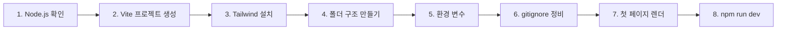

# PROJECT SETUP — Vite 프로젝트 첫 세팅 가이드

> 이 문서는 **프론트 처음**인 사람이 명령어를 그대로 따라치면 "브라우저에 첫 페이지가 뜨는 상태"까지 도달하도록 설계된 핸즈온이다.
> 막히면 §11 트러블슈팅을 먼저 본다.

---

## 0. 이 문서를 따라가기 전 알아둘 것

본 가이드는 다음 8단계 순서로 진행된다:



각 단계가 끝날 때마다 **검증 체크포인트**가 있다. 통과하지 못하면 다음 단계로 가지 말고 §11을 본다.

---

## 1. 사전 요구사항 — Node.js 확인

> **Node.js**: 자바스크립트를 브라우저 밖(터미널)에서 실행하기 위한 런타임. Vite·npm이 이걸 사용한다.

### 1-1. 설치 확인

터미널에서:

```bash
node -v
npm -v
```

기대값:

- `node -v` → **v20.x 이상** (Vite 5/6+ 요구사항). v22 LTS 권장.
- `npm -v` → **10.x 이상**.

### 1-2. 설치 안 되어 있거나 너무 낮으면

macOS 사용자 권장:

```bash
# Homebrew로 nvm 설치
brew install nvm

# nvm으로 LTS 설치
nvm install --lts
nvm use --lts
```

> **nvm**(Node Version Manager): Node 버전을 프로젝트마다 다르게 쓸 수 있게 해주는 도구.

### 1-3. 패키지 매니저 선택

본 프로젝트는 **npm으로 통일**한다. `pnpm`/`yarn`도 가능하지만:

- `package-lock.json` vs `pnpm-lock.yaml` 같은 락 파일이 섞이면 협업 시 혼선
- 본 프로젝트는 1인 개발이지만 일관성을 위해 npm 하나로 고정

✅ **체크포인트**: `node -v`가 v20+ 이면 다음으로 진행.

---

## 2. Vite 프로젝트 생성

> **주의**: 우리는 이미 `frontend_project/` 폴더에 `CLAUDE.md`, `docs/`, `.git/`가 들어있다. **빈 폴더가 아니다.**
> Vite를 "현재 디렉토리"에 추가하는 형태로 설치한다.

### 2-1. 현재 위치 확인

```bash
cd ~/Desktop/moji_project/frontend_project
pwd

```

### 2-2. Vite 프로젝트 생성

```bash
npm create vite@latest .
```

> `.` (점)은 "현재 디렉토리에 생성"을 의미.

#### 인터랙티브 프롬프트 응답

1. **`Current directory is not empty. Please choose how to proceed:`**
   → ⬇️/⬆️ 키로 **`Ignore files and continue`** 선택 후 Enter
   - 이유: `CLAUDE.md`, `docs/`, `.git/`을 지우지 않고 Vite 파일만 추가
   - "Remove existing files"는 절대 선택 금지 (docs 다 날아감)

2. **`Select a framework:`** → **`React`** 선택

3. **`Select a variant:`** → **`JavaScript`** 선택
   - (TypeScript 옵션이 있지만 본 프로젝트는 JS 확정. CLAUDE.md §5-2 참조)

### 2-3. 의존성 설치

```bash
npm install
```

> 처음 한 번만 실행. `package.json`에 명시된 의존성을 `node_modules/`에 받아온다.
> 1~2분 소요. 경고(warn)는 무시해도 됨. 빨간 ERROR만 주목.

### 2-4. 설치된 구조 확인

```bash
ls -a
```

기대 결과:

```
.eslintrc.cjs  (또는 eslint.config.js)
.git/
.gitignore
CLAUDE.md             ← 우리 거 그대로 살아있음
README.md             ← Vite가 새로 만든 거. 나중에 우리 내용으로 덮어 써도 됨
docs/                 ← 우리 거 그대로
index.html            ← Vite 진입 HTML
node_modules/         ← 라이브러리들
package.json          ← 의존성 + 스크립트
package-lock.json     ← 의존성 잠금 (git에 포함)
public/
src/
vite.config.js
```

✅ **체크포인트**: `CLAUDE.md`와 `docs/`가 그대로 있고, `src/`·`vite.config.js`·`package.json`이 새로 생성됐는지 확인.

---

## 3. Tailwind CSS 설치 및 설정

> **Tailwind CSS**: 미리 정의된 유틸리티 클래스(`p-4`, `text-lg`, `bg-blue-500`)를 HTML에 직접 붙여 스타일링하는 CSS 프레임워크. CSS 파일을 거의 안 만들고도 디자인 가능.

본 프로젝트는 **Tailwind v3.x (안정)** 를 사용한다.

- 이유: 자료·튜토리얼·생태계가 풍부해서 학습 친화적. v4는 새로 나왔지만 PostCSS 의존 구조가 바뀌어 초보가 막혔을 때 검색 결과가 v3와 섞여 헷갈림.

### 3-1. 설치

```bash
npm install -D tailwindcss@^3 postcss autoprefixer
npx tailwindcss init -p
```

> `-D`: devDependency로 설치 (빌드 시에만 필요, 런타임 X)
> `init -p`: `tailwind.config.js` + `postcss.config.js` 자동 생성

### 3-2. `tailwind.config.js` 수정

Vite가 만든 기본 파일을 다음으로 **덮어쓴다**.

```javascript
/** @type {import('tailwindcss').Configuration} */
export default {
  // 어떤 파일에서 Tailwind 클래스를 찾을지 명시
  content: ["./index.html", "./src/**/*.{js,jsx}"],
  theme: {
    extend: {
      // 노년층 친화 폰트 사이즈 (최소 18px부터)
      // 자세한 토큰은 docs/STYLING_GUIDE.md에서 정의/확장 예정
      fontSize: {
        "senior-base": ["18px", { lineHeight: "1.6" }],
        "senior-lg": ["22px", { lineHeight: "1.5" }],
        "senior-xl": ["28px", { lineHeight: "1.4" }],
      },
    },
  },
  plugins: [],
};
```

> ⚠️ **임시 토큰만 박아둔다.** 정식 색·간격·breakpoint 토큰은 `docs/STYLING_GUIDE.md` 작성 후 한꺼번에 갱신할 예정. 지금은 노년층 폰트 사이즈만 동작 검증용으로 추가.

### 3-3. `postcss.config.js` 확인

`tailwindcss init -p`로 자동 생성된 파일이 다음과 같아야 한다:

```javascript
export default {
  plugins: {
    tailwindcss: {},
    autoprefixer: {},
  },
};
```

> 만약 `module.exports = ...` 형태로 생성됐다면 위 형태(`export default`)로 바꿔야 한다. Vite는 ESM 기본.

### 3-4. `src/index.css` 작성

기존 `src/index.css`를 **전체 덮어쓴다**:

```css
@tailwind base;
@tailwind components;
@tailwind utilities;

/* 노년층 친화 글로벌 기본값 */
html {
  font-size: 18px; /* 브라우저 기본 16px → 18px */
}

body {
  font-family:
    system-ui,
    -apple-system,
    "Apple SD Gothic Neo",
    "Noto Sans KR",
    sans-serif;
  -webkit-font-smoothing: antialiased;
}
```

> `@tailwind` 3줄이 핵심. Tailwind 빌드 결과가 여기에 주입된다.

### 3-5. `src/main.jsx`에서 CSS import 확인

Vite 기본 템플릿은 `src/index.css`를 import하지만 점검:

```javascript
import { StrictMode } from "react";
import { createRoot } from "react-dom/client";
import "./index.css"; // ← 이 줄이 있는지 확인
import App from "./App.jsx";

createRoot(document.getElementById("root")).render(
  <StrictMode>
    <App />
  </StrictMode>,
);
```

✅ **체크포인트**: 위 4개 파일 모두 저장 후 §8에서 `npm run dev`를 띄웠을 때 Tailwind 클래스가 동작해야 함.

---

## 4. 폴더 구조 만들기

CLAUDE.md §3에서 정의한 폴더 구조를 미리 만들어둔다 (지금은 빈 폴더 + `.gitkeep`).

```bash
cd /Users/hoyoung/Desktop/moji_project/frontend_project

mkdir -p src/pages src/components/common src/components/welfare src/components/chat
mkdir -p src/hooks src/contexts src/api src/utils src/styles

touch src/pages/.gitkeep
touch src/components/common/.gitkeep
touch src/components/welfare/.gitkeep
touch src/components/chat/.gitkeep
touch src/hooks/.gitkeep
touch src/contexts/.gitkeep
touch src/api/.gitkeep
touch src/utils/.gitkeep
touch src/styles/.gitkeep
```

> **`.gitkeep`**: Git은 빈 폴더를 추적하지 않으므로, 빈 폴더를 commit하려면 임시 파일 하나가 필요. 내용은 비어있어도 됨.

✅ **체크포인트**: `ls src/`로 9개 폴더가 보이는가.

---

## 5. 환경 변수 설정

### 5-1. `.env.local` 작성 (프로젝트 루트)

```bash
cat > .env.local <<'EOF'
# 백엔드 API 베이스 URL (개발 환경)
VITE_API_BASE_URL=http://localhost:8080
EOF
```

> Vite는 **`VITE_` 접두사 변수만** 클라이언트 코드에 노출시킨다. 그 외 변수는 `import.meta.env`로 접근 불가 → 비밀 정보가 번들에 섞이지 않게 막는 안전장치.

### 5-2. `.env.example` 작성 (깃에 포함)

```bash
cat > .env.example <<'EOF'
# 이 파일은 변수 이름만 깃에 올린다. 실제 값은 .env.local에 작성.
VITE_API_BASE_URL=
EOF
```

> 다른 컴퓨터에서 클론할 때 어떤 환경 변수가 필요한지 알려주는 안내 파일.

### 5-3. 코드에서 사용하는 법 (이후 작성 시 참고)

```javascript
const baseUrl = import.meta.env.VITE_API_BASE_URL;
// → "http://localhost:8080"
```

✅ **체크포인트**: `.env.local`이 프로젝트 루트에 생성됐는가.

---

## 6. `.gitignore` 정비

Vite 기본 `.gitignore`에는 `node_modules/`·`dist/` 등이 이미 포함되어 있다. 본 프로젝트가 추가로 막아야 할 것을 더한다.

`.gitignore` 파일을 열어 **맨 아래에 추가**:

```gitignore
# 환경 변수 (실제 값)
.env.local
.env.*.local

# 에디터/OS
.DS_Store
.vscode/
.idea/

# 빌드 산출
dist/
dist-ssr/
*.local
```

> `.env.example`은 깃에 **올라가야** 하므로 `.env.*.local`에 매칭되지 않게 주의 (이미 매칭 안 됨).

확인:

```bash
git status .env.local
# → "ignored" 또는 출력 없음 (정상)

git status .env.example
# → "untracked" (정상, 곧 add 가능)
```

✅ **체크포인트**: `.env.local`이 ignore되고 `.env.example`은 추적 가능 상태인가.

---

## 7. 첫 페이지 렌더 — Hello MOZI

`src/App.jsx`를 다음 내용으로 **덮어쓴다**:

```jsx
/**
 * App
 *
 * 프로젝트 첫 세팅 검증용 최소 화면.
 * Tailwind 노년층 폰트 토큰과 노년층 친화 버튼이 의도대로 보이는지 확인한다.
 *
 * @returns {JSX.Element}
 */
function App() {
  return (
    <main className="min-h-screen bg-white flex flex-col items-center justify-center gap-6 px-6">
      <h1 className="text-senior-xl font-bold text-gray-900">
        🏛️ MOZI — 노인 맞춤 복지 안내
      </h1>

      <p className="text-senior-base text-gray-700 max-w-lg text-center">
        프론트엔드 첫 세팅이 정상 동작하면 이 문장이 18px 이상으로 보입니다.
        Tailwind 토큰 <code className="bg-gray-100 px-1">text-senior-base</code>
        가 적용되어 있어요.
      </p>

      <button
        type="button"
        className="h-12 px-6 rounded-lg bg-blue-600 text-white text-senior-base hover:bg-blue-700"
        onClick={() => alert("버튼이 잘 동작합니다!")}
      >
        클릭해보기
      </button>

      <p className="text-sm text-gray-500 mt-8">
        API_BASE: {import.meta.env.VITE_API_BASE_URL || "(설정 안 됨)"}
      </p>
    </main>
  );
}

export default App;
```

검증 포인트:

- 제목이 28px 정도로 크게 보인다 (`text-senior-xl`)
- 본문이 18px 이상 (`text-senior-base`)
- 버튼이 높이 48px (`h-12`)
- 하단에 `API_BASE: http://localhost:8080` 표시 (환경 변수 정상 로드)

---

## 8. 개발 서버 실행 — `npm run dev`

```bash
npm run dev
```

기대 출력:

```
  VITE v5.x.x  ready in 350 ms

  ➜  Local:   http://localhost:5173/
  ➜  Network: use --host to expose
  ➜  press h + enter to show help
```

브라우저에서 **http://localhost:5173** 접속.

### 정상 확인 체크리스트

- [ ] "🏛️ MOZI — 노인 맞춤 복지 안내" 큰 제목이 보인다
- [ ] 본문 텍스트가 18px 이상으로 보인다 (브라우저 확대/축소 100%에서)
- [ ] 파란 버튼 클릭 시 alert가 뜬다
- [ ] 하단에 `API_BASE: http://localhost:8080`가 표시된다 (괄호 메시지 X)

✅ **체크포인트 통과** = 프론트 첫 세팅 끝.

---

## 9. (선택) ESLint + Prettier 정비

Vite가 자동으로 ESLint 기본 설정을 추가했다. 그대로 써도 무방하지만, Prettier도 함께 쓰고 싶으면:

```bash
npm install -D prettier eslint-config-prettier
```

루트에 `.prettierrc` 작성:

```json
{
  "semi": true,
  "singleQuote": false,
  "trailingComma": "all",
  "printWidth": 100,
  "tabWidth": 2
}
```

> **ESLint vs Prettier**:
>
> - ESLint: "잘못된 코드/안티패턴" 잡기 (논리적 문제)
> - Prettier: "코드 모양" 통일 (들여쓰기, 따옴표, 줄바꿈)
> - 함께 쓰면 좋고, 우선은 ESLint만 써도 됨

본 프로젝트는 우선 ESLint 기본만 쓰고, Prettier 도입은 코드 양이 늘었을 때 검토.

---

## 10. 다음 단계 — 어디로 가야 하나

세팅이 끝났다면 다음 docs를 따라간다:

| 다음 작업                                     | 참고 문서                                  |
| --------------------------------------------- | ------------------------------------------ |
| 디자인 토큰 본격 정의 (색·간격·breakpoint 등) | `docs/STYLING_GUIDE.md`                    |
| 폴더 구조와 컴포넌트 분리 원칙 익히기         | `docs/COMPONENT_ARCHITECTURE.md`           |
| 백엔드 API 호출 코드(fetch wrapper) 작성      | `docs/API_CLIENT_GUIDE.md`                 |
| 라우팅·페이지 흐름 이해                       | `docs/USER_FLOW.md`, `docs/SCREEN_SPEC.md` |
| 단계별 실행 계획                              | `docs/EXECUTION_PLAN.md`                   |

---

## 11. 트러블슈팅 (자주 막히는 부분)

### 11-1. `npm run dev`가 실행되지 않는다

- 증상: `command not found` 또는 `Missing script: "dev"`
- 원인: `package.json`이 없거나 `npm install`을 빠뜨림
- 해결: `ls package.json`으로 존재 확인 후 `npm install` 재실행

### 11-2. Tailwind 클래스가 안 먹는다

- 증상: `text-senior-base`를 써도 폰트가 변하지 않음
- 원인 1: `tailwind.config.js`의 `content` 배열이 잘못됨 → `./src/**/*.{js,jsx}` 확인
- 원인 2: `src/index.css`의 `@tailwind` 3줄 누락 → §3-4 다시 적용
- 원인 3: `src/main.jsx`에 `import "./index.css"` 누락 → §3-5 확인
- 해결 후: 개발 서버 재시작 (`Ctrl+C` 후 `npm run dev`)

### 11-3. `import.meta.env.VITE_API_BASE_URL`가 undefined

- 원인: 변수명에 `VITE_` 접두사 없음
- 해결: `.env.local`의 변수명이 `VITE_`로 시작하는지 확인 + 개발 서버 재시작
  - Vite는 `.env*` 파일 변경 시 서버 재시작이 필요한 경우가 많음

### 11-4. `npm create vite`가 기존 docs를 지웠다

- 원인: 프롬프트에서 "Remove existing files" 선택
- 해결: `git checkout HEAD -- docs/ CLAUDE.md`로 복구 (커밋되어 있다면)
- 예방: 다음부터 반드시 **"Ignore files and continue"** 선택

### 11-5. 포트 5173이 이미 사용 중

- 증상: `Port 5173 is in use`
- 해결: Vite가 자동으로 다음 포트(5174 등)로 옮긴다. 출력의 `Local:` URL을 사용.

### 11-6. 백엔드 CORS 에러

- 증상: 콘솔에 `Access-Control-Allow-Origin` 관련 에러
- 본 단계에서는 fetch 호출이 없으므로 발생하지 않음. API 호출 시점에 발생하면 `docs/API_CLIENT_GUIDE.md` 참조.
- 참고: 백엔드 `application.yml`에 `http://localhost:5173`이 이미 허용되어 있음 (backend `CorsConfig`)

### 11-7. macOS Apple Silicon에서 esbuild 경고

- 증상: `esbuild` 관련 빌드 경고
- 대부분 무시 가능. 빨간 ERROR만 주목.

---

## 12. 변경 이력

| 날짜       | 변경 내용                                                              |
| ---------- | ---------------------------------------------------------------------- |
| 2026-05-15 | 초안 작성 — Node 확인부터 첫 페이지 렌더까지 8단계 핸즈온 + 트러블슈팅 |
