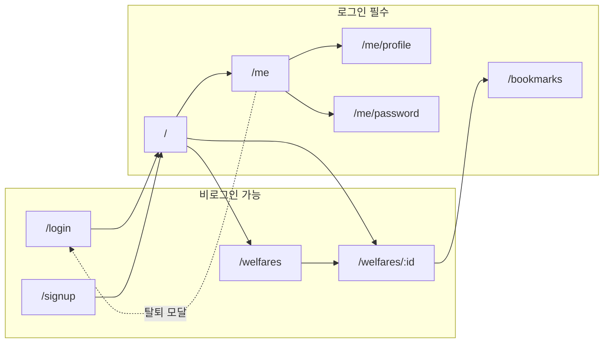
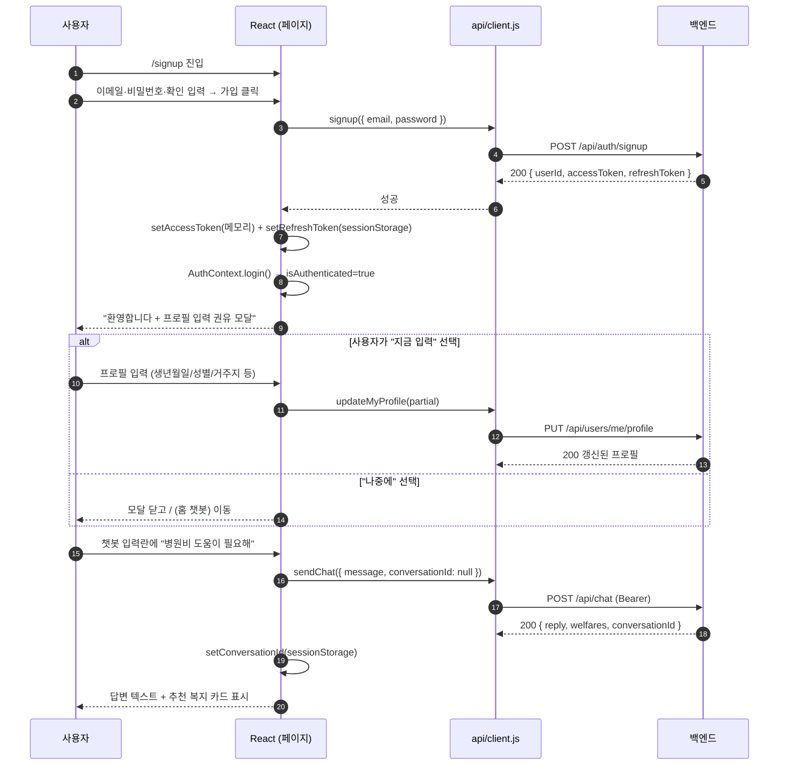
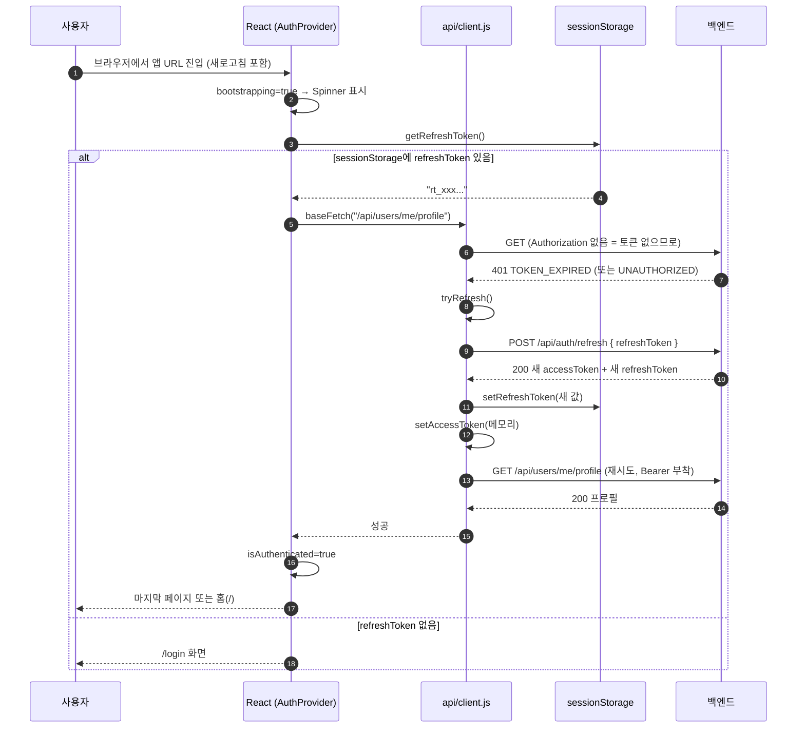
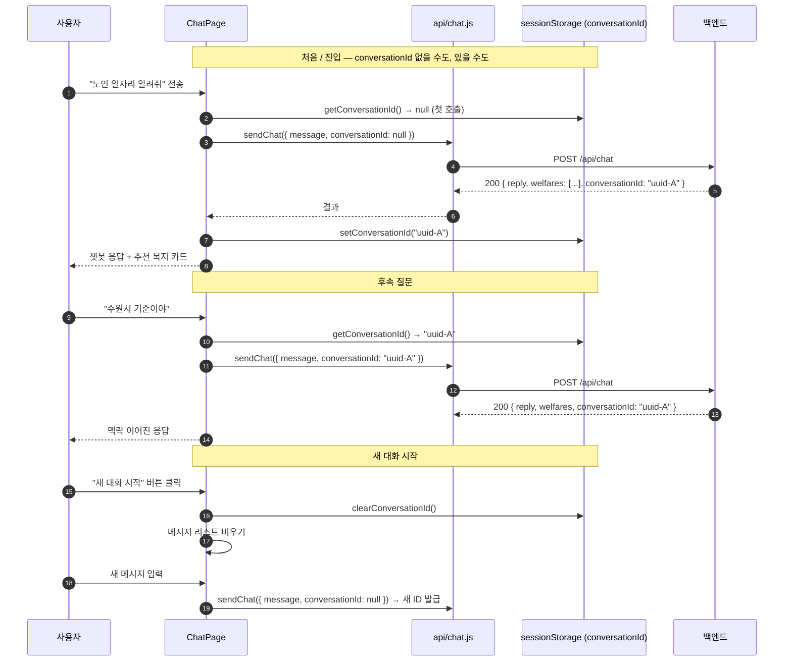
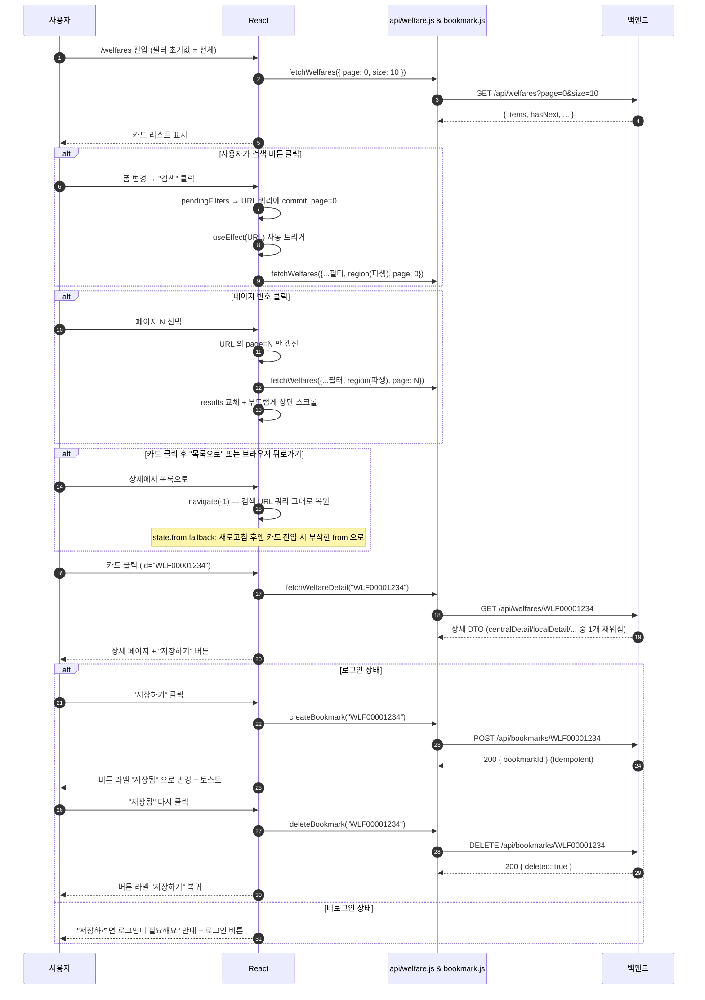
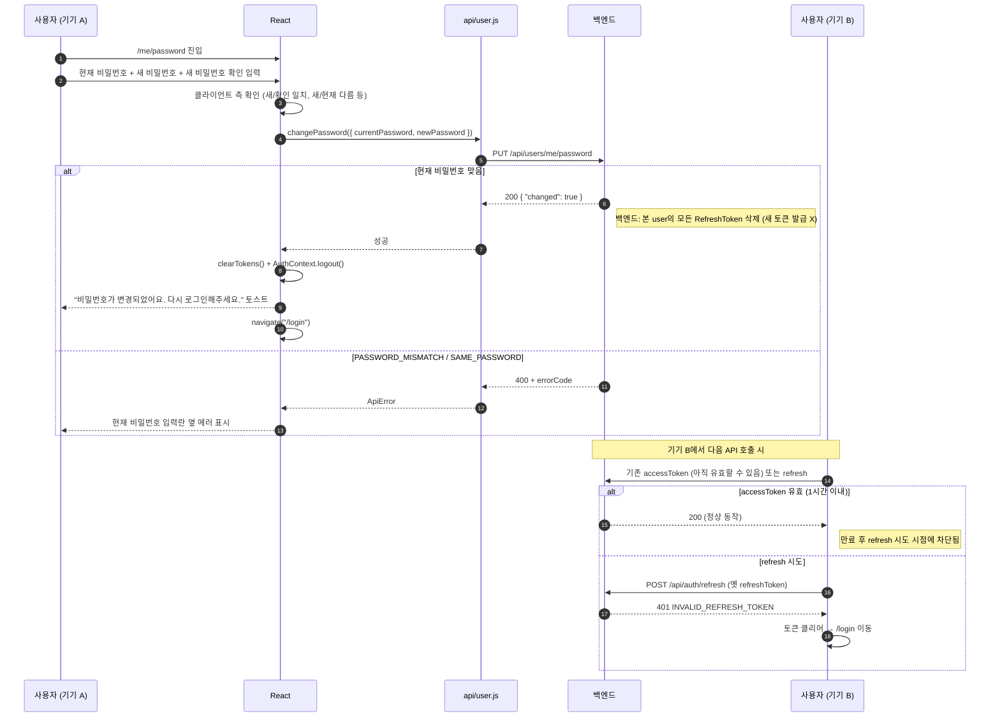
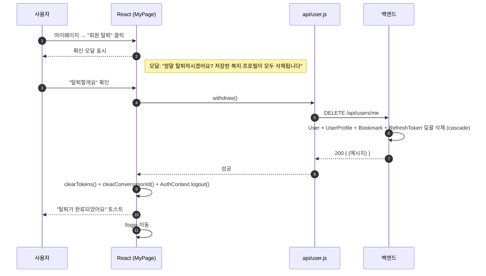
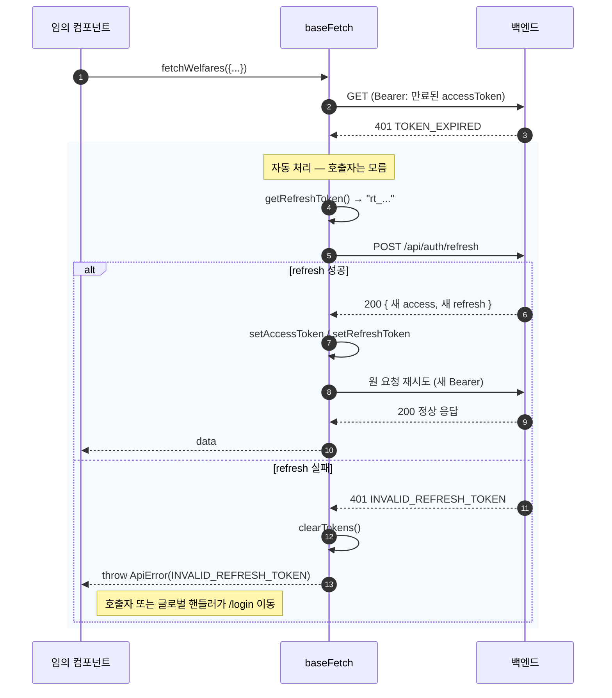
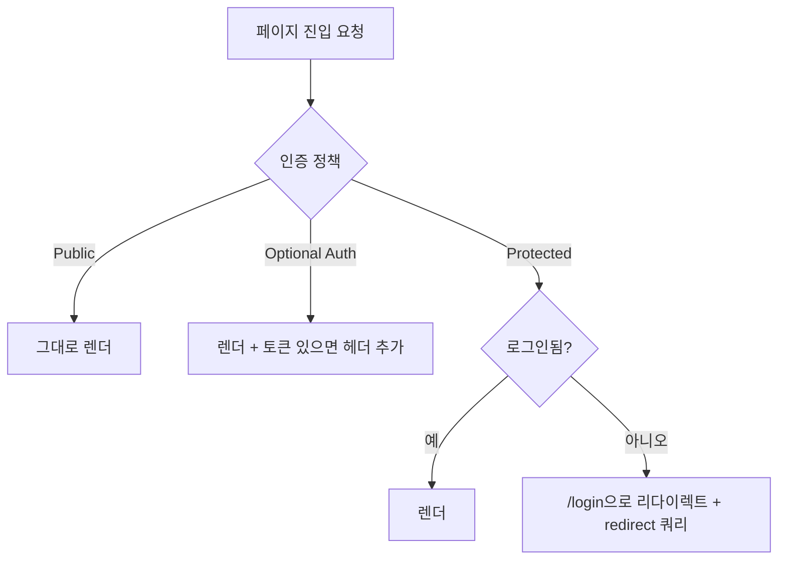
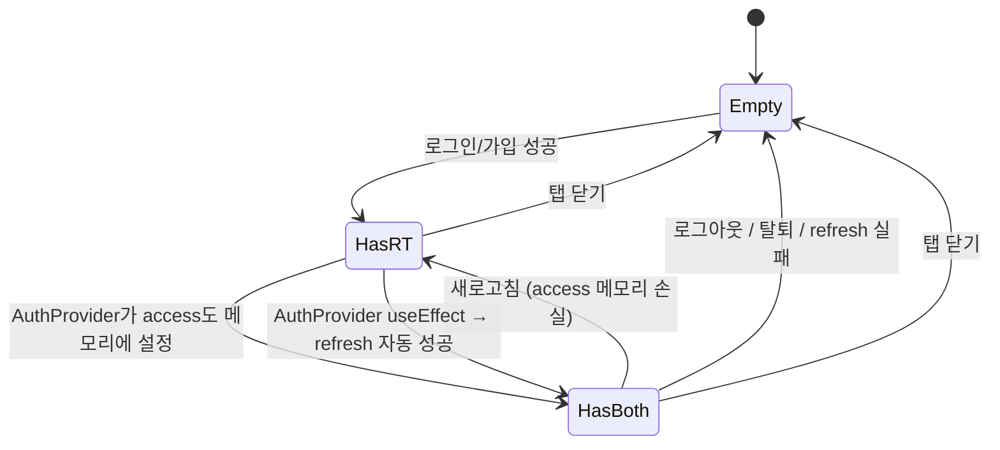

# USER FLOW — 화면 단위 사용자 흐름

> 이 문서는 백엔드 `USER_FLOW.md`의 7개 시퀀스를 **프론트 화면 전환 관점**으로 재해석한다.
> 모든 mermaid는 머릿속에 그릴 수 있는 수준으로 단순화했다. 정확한 API 스키마는 `../backend_project/docs/API_SPEC.md` 참조.

---

## 1. 전체 화면 맵



라우팅 정책 요약:
- **로그인 필수(`Protected`)**: 토큰 없으면 `/login`으로 자동 이동
- **비로그인 가능(`Public`)**: 검색/상세는 누구나 조회. 단, 북마크 버튼은 로그인 사용자만 활성
- **`/`(홈)** = 챗봇 메인 = 로그인 필수

자세한 라우팅 가드 구현은 §9 + `API_CLIENT_GUIDE.md` §8 참조.

---

## 2. 시나리오 A — 신규 가입 → 프로필 입력 → 첫 검색



핵심 포인트:
- 가입 직후 **즉시 토큰 발급되어 자동 로그인 상태** (별도 로그인 단계 없음)
- 프로필 입력 권유는 **모달**로 (페이지 이동 X — 사용자가 챗봇으로 바로 갈 수 있게)
- `conversationId`는 **첫 호출 시 null**, 응답으로 받은 ID를 sessionStorage에 저장

빈 상태 / 에러 처리:
- 이메일 중복(`EMAIL_ALREADY_EXISTS`) → "이미 가입된 이메일이에요" 인풋 옆 표시
- 검증 실패(`VALIDATION_FAILED`) → `fields` 객체를 각 입력란에 매핑
- 챗봇 타임아웃(`CHATBOT_TIMEOUT`) → "지금은 추천이 어려워요" 안내 + 재시도 버튼

---

## 3. 시나리오 B — 재방문 로그인 (토큰 자동 복구)



핵심 포인트:
- **accessToken은 새로고침 시 항상 사라짐** (메모리 보관) → refresh가 필수 절차
- AuthProvider의 useEffect에서 **1회만** 시도 (조건: `getRefreshToken()`이 있을 때)
- `bootstrapping` 동안은 ProtectedRoute가 Spinner를 보여줘 깜빡임 방지
- refresh 실패 시 토큰 모두 클리어 → 자연스럽게 로그인 화면

> 본 흐름은 `API_CLIENT_GUIDE.md` §8 `AuthProvider`의 useEffect 구현과 일치.

---

## 4. 시나리오 C — 챗봇 첫 대화 → 후속 질문 → 새 대화



핵심 포인트:
- `conversationId` = sessionStorage 단일 출처 (`utils/conversationStore.js`)
- 첫 호출에 `null`을 보내면 **백엔드가 UUID v4 발급**
- 후속 호출은 받은 ID를 그대로 재전송
- "새 대화 시작" = sessionStorage에서 ID 삭제 + 화면 리셋

빈 상태 / 에러:
- 첫 진입 시 메시지 목록 비어있으면 → 안내문 "안녕하세요. 어떤 복지를 찾고 계신가요?"
- `recommendedWelfareIds = []` (잡담/범위 외) → 답변 텍스트만 표시, 카드 영역은 숨김
- `CHATBOT_TIMEOUT/UNAVAILABLE/INVALID_RESPONSE` → 마지막 메시지 옆 "다시 시도" 버튼

---

## 5. 시나리오 D — 복지 검색 → 상세 → 북마크



핵심 포인트:
- 검색은 **optional auth** — 비로그인도 조회 가능. 로그인 시 응답에 `isBookmarked` 가 자동 채워진다.
- 본인 맞춤 추천(옛 `applyMyProfile`)은 2026-05-17 백엔드 변경으로 검색 API에서 폐기됨. 대신 `POST /api/chat`(챗봇)이 담당.
- **검색 조건과 페이지 번호는 URL 쿼리에 보관** — 브라우저 뒤로가기/새로고침/링크 공유 모두 자동 복원. "검색" 클릭 = URL commit, 폼 입력 중 임시값은 URL 에 안 들어감.
- 필터 변경(검색 클릭) 시 `page=0`으로 리셋 (이전 결과가 섞이지 않게)
- 페이지 번호 방식 (이전/다음 + 최대 5개 번호 chip, 무한 스크롤 X)
- 북마크는 **Idempotent** — 같은 ID로 POST 중복 호출해도 안전
- 비로그인 + 북마크 시도 → 모달이 아니라 인라인 안내 (의도된 흐름이라 모달 차단보다 친절)

빈 상태:
- 검색 결과 0건 → "조건에 맞는 복지가 없어요. 다른 키워드를 시도해보세요"
- `WELFARE_NOT_FOUND` (잘못된 ID 직접 진입) → "복지 정보를 찾을 수 없어요" + 목록으로 돌아가기 버튼

---

## 6. 시나리오 E — 마이페이지 → 비밀번호 변경 (모든 기기 강제 재로그인)



핵심 포인트:
- 현재 비밀번호 검증은 **백엔드가** 한다 (프론트는 입력 형식 검증만)
- 백엔드 응답은 `{ "changed": true }`만 — **새 토큰을 발급하지 않는다**
- 백엔드는 본 user의 **모든 refreshToken을 삭제** → 본 기기 포함 모든 기기에서 재로그인 필요
- 본 기기 프론트는 변경 성공 시 즉시 `clearTokens()` + `/login` 이동
- 토스트 문구: **"비밀번호가 변경되었어요. 다시 로그인해주세요."**
  - 본 기기까지 재로그인이 필요해진 점이 사용자에게 명확히 전달되어야 함

---

## 7. 시나리오 F — 회원 탈퇴 (Hard Delete)



핵심 포인트:
- **확인 모달 필수** (액션이 비가역) — 노년층은 실수로 누를 가능성 ↑
- 모달 본문에 "무엇이 삭제되는지" 명시
- 탈퇴 후 같은 이메일로 재가입 가능 (백엔드 보장)

---

## 8. 시나리오 G — 토큰 만료 자동 복구 (백그라운드, 모든 호출 공통)



핵심 포인트:
- 컴포넌트는 **이 흐름을 몰라도 된다** — `baseFetch`가 모두 처리
- 재시도는 **1회만** (`retried` 플래그) — 무한 루프 방지
- refresh 실패 시 `ApiError`가 컴포넌트까지 올라옴 → 글로벌 에러 핸들러가 라우팅 결정

> 자세한 코드는 `API_CLIENT_GUIDE.md` §4 (`doFetch` 함수) 참조.

---

## 9. 라우팅 가드 — 페이지별 인증 정책



| 페이지 | 정책 | 비로그인 동작 |
|---|---|---|
| `/login` | Public | 그대로 |
| `/signup` | Public | 그대로 |
| `/` (챗봇) | Protected | `/login`으로 리다이렉트 |
| `/welfares` | Optional Auth | 그대로 (로그인 시 응답에 isBookmarked 자동 채움) |
| `/welfares/:id` | Optional Auth | 그대로 (북마크 버튼만 비활성) |
| `/bookmarks` | Protected | `/login`으로 리다이렉트 |
| `/me` | Protected | `/login`으로 리다이렉트 |
| `/me/profile` | Protected | `/login`으로 리다이렉트 |
| `/me/password` | Protected | `/login`으로 리다이렉트 |

구현은 `<ProtectedRoute>` 래퍼로 (`API_CLIENT_GUIDE.md` §8 참조).

리다이렉트 시 쿼리:
```
/login?redirect=%2Fbookmarks
```
로그인 성공 후 `redirect` 쿼리가 있으면 그쪽으로 이동 (UX 향상).

---

## 10. sessionStorage 라이프사이클



**저장 항목 3종**:

| 키 | 값 | 채우는 시점 | 비우는 시점 |
|---|---|---|---|
| `mozi_refresh_token` (sessionStorage) | refreshToken raw 문자열 | 로그인/가입/refresh 성공 시 | 로그아웃·탈퇴·refresh 실패·탭 닫기(자동) |
| `mozi_conversation_id` (sessionStorage) | UUID v4 | 챗봇 첫 메시지 응답 시 | "새 대화 시작"·로그아웃·탈퇴·탭 닫기(자동) |
| `accessToken` (메모리) | JWT | 로그인/가입/refresh 성공 시 | 로그아웃·탈퇴·새로고침(자동)·refresh 실패 |

핵심 규칙:
- **로그아웃 = 3개 모두 비우기** (`AuthContext.logout` 한 곳에서 일괄 처리)
- **탈퇴 = 로그아웃과 동일 + 이후 `/login` 이동**
- **탭 닫기 = 자동으로 모두 비워짐** (sessionStorage 특성 + 메모리 휘발)
- **새로고침 = accessToken만 사라짐 → refresh로 자동 복구**

---

## 11. 노년층 UX 흐름 체크포인트

각 시나리오에서 "사용자가 헷갈리지 않는가" 확인 포인트.

| 시나리오 | 체크포인트 |
|---|---|
| 가입 | "회원가입 → 로그인" 2단계가 아니라 가입 즉시 로그인됨을 명확히 안내 |
| 챗봇 | 응답 대기 중 로딩 인디케이터 명시적으로 보이는가 (8초까지 기다림) |
| 검색 | 필터 변경 시 결과가 바로 갱신됨이 시각적으로 보이는가 (Spinner 또는 결과 영역 깜빡임) |
| 북마크 | 토글 직후 버튼 라벨 변경 + 가벼운 토스트 — "저장됐다"는 신호 명확 |
| 비밀번호 변경 | "변경 후 본 기기를 포함한 모든 기기에서 재로그인 필요"가 사용자에게 충분히 전달되는가 (변경 직후 자동으로 /login으로 이동) |
| 탈퇴 | "어떤 데이터가 삭제되는지" 모달에 명시 |
| 토큰 만료 | 자동 복구 시 사용자에게 보이지 않게 — "갑자기 로딩이 길어졌다" 인식조차 안 들게 |

---

## 12. 참고 — 백엔드 USER_FLOW.md와의 차이

| 항목 | 백엔드 문서 | 본 문서 |
|---|---|---|
| 시점 | API 호출 시퀀스 (POST/GET 순서) | 화면 전환 + 사용자 액션 |
| 관심사 | DB 상태 변화 | 컴포넌트 상태 + sessionStorage |
| 대상 | 백엔드 개발자 | 프론트 개발자(나) |

두 문서가 모순될 경우 **API_SPEC.md(엔드포인트 사양)가 항상 우선**. 본 문서는 그 위에서 화면을 짤 때의 흐름만 정리.

---

## 13. 변경 이력

| 날짜 | 변경 내용 |
|---|---|
| 2026-05-15 | 초안 작성 — 7개 시나리오 mermaid + 라우팅 가드 + sessionStorage 라이프사이클 + UX 체크포인트 |
| 2026-05-17 | 페이지네이션 룰 정정 — 시나리오 D 의 "더 보기" 클릭 흐름을 페이지 번호 클릭 + 결과 교체로 갱신 |
| 2026-05-17 | 검색 상태 URL 동기화로 전환 — 시나리오 D 의 필터/페이지 흐름 및 "목록으로" 동작(navigate(-1) + state.from fallback) 명시. 새로고침/뒤로가기/링크 공유에도 검색 상태 보존 |
